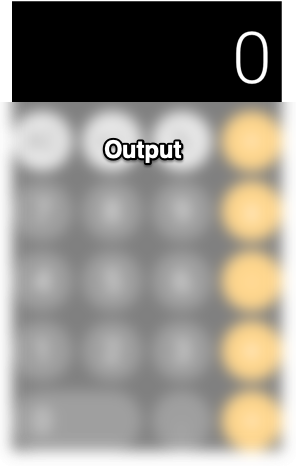

# [Todo](https://github.com/nacular/doodle-tutorials/tree/master/Todo) Tutorial
----


```doodle
{
    "border": false,
    "height": "700px",
    "run"   : "DocApps.todo"
}
```

--- 

## Project Setup

We will use a multi-platform setup for this app. This is not necessary to use Doodle, but it lets us implement our code almost
entirely in commonMain and our tests in commonTest. We will then be able to run these tests on the JVM target, which will
make their execution really fast and completely decoupled from the JS environment.

[**build.gradle.kts**](https://github.com/nacular/doodle-tutorials/blob/master/Calculator/build.gradle.kts)

```kotlin
plugins {
    kotlin("multiplatform")
}

kotlin {
    // Defined in buildSrc/src/main/kotlin/Common.kt
    jsTargets ()
    jvmTargets()

    // Defined in gradle.properties
    val mockkVersion     : String by project
    val mockkJsVersion   : String by project
    val doodleVersion    : String by project
    val coroutinesVersion: String by project

    sourceSets {
        val commonMain by getting {
            dependencies {
                implementation(kotlin("stdlib-common"))

                // needed for async font discovery
                implementation("org.jetbrains.kotlinx:kotlinx-coroutines-core-common:$coroutinesVersion")

                api ("io.nacular.doodle:core:$doodleVersion"    ) // required for Doodle
                api ("io.nacular.doodle:browser:$doodleVersion" ) // required for Doodle in the browser
                api ("io.nacular.doodle:controls:$doodleVersion") // provides things like buttons and panels
            }
        }

       // ...
    }
}
```

---

## Defining Our Application

All Doodle apps must implement the [`Application`](https://github.com/nacular/doodle/blob/master/Core/src/commonMain/kotlin/io/nacular/doodle/application/Application.kt#L4)
interface. The framework will then initialize our app via the constructor. Our app will be fairly simple: just create
an instance of our calculator and add it to the display.

Doodle apps can be defined in `commonMain`, since they do not require any platform-specific dependencies. Therefore, we will do
the same and place ours in `commonMain/kotlin/io/nacular/doodle/examples`.

[**CalculatorApp.kt**](https://github.com/nacular/doodle-tutorials/blob/master/Calculator/src/commonMain/kotlin/io/nacular/doodle/examples/CalculatorApp.kt#L11)

```kotlin
package io.nacular.doodle.examples

// ...

class CalculatorApp(display: Display): Application {
    init {
        // creat and display a single Calculator
        display += Calculator()
    }

    override fun shutdown() { /* no-op */ }
}
```

?> Notice that `shutdown` is a no-op, since we don't have any cleanup to do when the app closes.

---

## Defining Main + Fullscreen

Doodle apps can be [launched](https://nacular.github.io/doodle/#/applications) in a few different ways.
For our purposes, we will create a `main` and run this [top-level](https://nacular.github.io/doodle/#/applications?id=top-level-apps) in full screen.

[**Main.kt**](https://github.com/nacular/doodle-tutorials/blob/master/Calculator/src/jsMain/kotlin/io/nacular/doodle/examples/Main.kt#L12)

```kotlin
package io.nacular.doodle.examples

//...

fun main() {
    application(modules = listOf(PointerModule)) {
        // load app
        CalculatorApp(instance()) // provide the Display
    }
}
```

The `application` function is used to launch top-level apps. It takes a list of modules to include and a lambda that builds the
app being launched. This lambda is within a Kodein injection context, which means we can inject dependencies into our app via
`instance`, `provider`, etc.

Notice that we have included the [`PointerModule`](https://github.com/nacular/doodle/blob/master/Browser/src/jsMain/kotlin/io/nacular/doodle/application/Modules.kt#L62).
This is needed to enable mouse or pointer interactions. Our app will not directly know we loaded this module, but pointer
related events will only work because we have.

?> Check out Kodein to learn more about how it handles dependency injection.

The `application` function also takes an optional HTML element within which the app will be hosted. The app will be hosted in
`document.body` if no element is specified.

App launching is the only part of our code that is platform-specific. This makes sense, since this is the only time we might care
about an HTML element. And the reason is to support use-cases where apps are embedded into non-Doodle contexts.

## The Calculator View

We will implement our calculator as a single [`View`](https://github.com/nacular/doodle/blob/master/Core/src/commonMain/kotlin/io/nacular/doodle/core/View.kt#L65)
that manages its state directly. This makes sense for simple use-cases, but might not be the right choice for larger apps.

This View will be broken into a hierarchy of views, with two top-level items: a custom output and a [`GridPanel`](https://github.com/nacular/doodle/blob/master/Controls/src/commonMain/kotlin/io/nacular/doodle/controls/panels/GridPanel.kt#L42).

<br>



### Calculator Output

The Output will be a really simple View that tracks a number and its text representation, which it will render to the screen.
It will also expose the number as the current "answer" on the calculator. Its most complex role is displaying the text with
proper alignment and scaling to avoid any clipping.

?> Notice how the output text starts off center aligned with the operator buttons; and how it shrinks as the number grows
beyond the screen size.

Take a look at the [**Output**](https://github.com/nacular/doodle-tutorials/blob/master/Calculator/src/commonMain/kotlin/io/nacular/doodle/examples/Calculator.kt#L48)
class, and you will see it has a `text` property that it tracks the width of. It also uses `textTransform` to perform the text scaling.

```kotlin
private inner class Output: View() {
    //...

    // Transform used to scale text down as it grows beyond window width
    private var textTransform = Identity

    //...

    /** Text representation of [number] */
    var text = "0"
        set(new) {
            field = new

            val textWidth   = textMetrics.width(field, font)
            val windowWidth = width - inset * 2

            // use transform when text grows beyond window width
            textTransform = when {
                textWidth > windowWidth -> (windowWidth/textWidth).let { Identity.scale(x = it, y = it, around = Point(width / 2, height)) }
                else                    -> Identity
            }

            rerender()
        }

    //...

    override fun render(canvas: Canvas) {
        val textPosition = textMetrics.size(text, font).let {
            val x = when {
                textTransform.isIdentity -> width - it.width - inset
                else                     -> (width - it.width) / 2
            }

            Point(x, height - it.height)
        }

        // scaling, if present, is applied to the canvas before text rendered
        canvas.transform(textTransform) {
            text(text, at = textPosition, font = font, color = foregroundColor ?: White)
        }
    }
}
```

## More Dependencies

The `Output` class, and others in `Calculator` need things like fonts, and the ability to measure text. Doodle provides
these capabilities via interfaces like `FontDetector` and `TextMetrics`. These can be provided to `Calculator` via
constructor injection.

That results in a constructor as follows:

[**Calculator.kt**](https://github.com/nacular/doodle-tutorials/blob/master/Calculator/src/commonMain/kotlin/io/nacular/doodle/examples/Calculator.kt#L35)

```kotlin
class Calculator(
        private val fonts          : FontDetector,
        private val textMetrics    : TextMetrics,
        private val numberFormatter: NumberFormatter
): View() {
}
```

This means `CalculatorApp` needs to be updated as well. We continue by injecting these dependencies there as well.

```kotlin
package io.nacular.doodle.examples

// ...

class CalculatorApp(
        display        : Display,
        textMetrics    : TextMetrics,
        fontDetector   : FontDetector,
        numberFormatter: NumberFormatter
): Application {
    init {
        // creat and display a single Calculator
        display += Calculator(fontDetector, textMetrics, numberFormatter)
    }

    override fun shutdown() { /* no-op */ }
}
```

Now `Main` needs to provide these, along with Display, when constructing the app.

```kotlin
package io.nacular.doodle.examples

//...

fun main() {
    application(modules = listOf(
        PointerModule,
        Module(name = "AppModule") {
            // Used to get fonts that should've been loaded
            bind<FontDetector>() with singleton { FontDetectorImpl(instance(), instance(), instance()) }
        }
    )) {
        // load app
        CalculatorApp(instance(), instance(), instance(), NumberFormatterImpl())
    }
}
```

?> Unlike `TextMetrics`, `FontDetector` is not included in Doodle's default modules, so we have to wire it explicitly.
We define a new `Module` to do so because it has dependencies that can be injected as well.

## The Buttons

We can manage the set of buttons within the calculator with a `GridPanel`. This way we get the layout support it provides.
This results in the following initialization for `Calculator`.

[**Calculator.kt**](https://github.com/nacular/doodle-tutorials/blob/master/Calculator/src/commonMain/kotlin/io/nacular/doodle/examples/Calculator.kt#L35)

```kotlin
class Calculator(/*...*/): View() {

    //...

    init {
        GlobalScope.launch {
            loadFonts()

            ButtonGroup(allowDeselectAll = true, buttons = *arrayOf(`÷`, `*`, `-`, `+`))

            val outputHeight  = 100.0
            val buttonSpacing =  10.0

            val gridPanel = GridPanel().apply {
                add(clear, 0, 0); add(negate, 0, 1); add(`%`, 0, 2); add(`÷`, 0, 3)
                add(`7`,   1, 0); add(`8`,    1, 1); add(`9`, 1, 2); add(`*`, 1, 3)
                add(`4`,   2, 0); add(`5`,    2, 1); add(`6`, 2, 2); add(`-`, 2, 3)
                add(`1`,   3, 0); add(`2`,    3, 1); add(`3`, 3, 2); add(`+`, 3, 3)
                add(`0`,   4, 0,  columnSpan = 2  ); add(decimal, 4, 2); add(`=`,  4, 3)

                verticalSpacing   = buttonSpacing
                horizontalSpacing = buttonSpacing
            }

            children += listOf(output, gridPanel)

            // Place output outside grid so the height can be more easily controlled
            val constraints = constrain(output, gridPanel) { output, grid ->
                output.top    = parent.top
                output.left   = parent.left
                output.right  = parent.right
                output.height = constant(outputHeight)

                grid.top      = output.bottom + buttonSpacing
                grid.left     = output.left
                grid.right    = output.right
                grid.bottom   = parent.bottom
            }

            layout = object: Layout by constraints {
                // Set total height to grid panel's ideal width and height, plus output and spacing
                override fun idealSize(container: PositionableContainer, default: Size?) = gridPanel.idealSize?.let {
                    Size(it.width, it.height + outputHeight + buttonSpacing)
                }
            }

            // Force idealSize when gridPanel is laid out
            gridPanel.sizePreferencesChanged += { _,_,new ->
                idealSize = new.idealSize?.let { Size(it.width, it.height + outputHeight + buttonSpacing) }
            }
        }
    }
    
    //...
}
```

The initialization steps are: **(1) load fonts**, **(2) setup buttons in GridPanel**, **(3) add Output and grid as children**,
**(4) configure the layout**.

This example uses non-standard/recommended property names for buttons to improve readability slightly. This also makes tests a little
simpler to understand.

## Button Styling

The calculator buttons come in a few different color schemes. But they all share the same [`Behavior`](https://github.com/nacular/doodle/blob/master/Core/src/commonMain/kotlin/io/nacular/doodle/core/Behavior.kt#L7),
defined by [`CalcButtonBehavior`](https://github.com/nacular/doodle-tutorials/blob/master/Calculator/src/commonMain/kotlin/io/nacular/doodle/examples/CalcButtonBehavior.kt#L16).
Buttons--like many Views--let you define their look-and-feel using a `Behavior`. Ours is fairly simple; it draws the rounded rectangle
for the button background and centers the text above it. These are both managed with the right color based on the button's state.
It gets state tracking and text positiong for free via its base class: `CommonTextButtonBehavior`.

## Custom Hit Detection

`CalcButtonBehavior` provides a rounded style for our buttons. But the default hit-detection for Views is tied to their rectangular
bounds. We can fix this by writing custom pointer hit-detection in our behavior.

```kotlin
class CalcButtonBehavior(textMetrics: TextMetrics): CommonTextButtonBehavior<Button>(textMetrics) {
    //...

    override fun contains(view: Button, point: Point): Boolean {
        val radius      = view.height / 2
        val leftCircle  = Circle(center = Point(view.x + radius,            view.center.y), radius = radius)
        val rightCircle = Circle(center = Point(view.bounds.right - radius, view.center.y), radius = radius)

        return when {
            point.x < radius              -> point in leftCircle
            point.x > view.width - radius -> point in rightCircle
            else                          -> point in view.bounds
        }
    }
}
```

The `contains(Button, Point)` method is called by `Button` to check whether the pointer is within its bounds. This logic ensures
the pointer will only "hit" our button when it goes within the rounded rectangle.

?> The `contains` check provides a `Point` in the View's **parent's** coordinates.

## Testing

Common code testing is one reason to use a multi-platform setup. Doodle is designed to avoid platform specific dependencies except in the
small amount of launch code. This means we can easily test `Calculator` and the other components by writing tests in `commonTest`
and running them on the JVM target. One advantage is the speed of running these tests, since there are no external dependencies.

The tests in [`CalculatorTests`](https://github.com/nacular/doodle-tutorials/blob/master/Calculator/src/commonTest/kotlin/io/nacular/doodle/examples/CalculatorTests.kt#L13)
are a bit contrived, but they illustrate how you might validate various parts of your app.