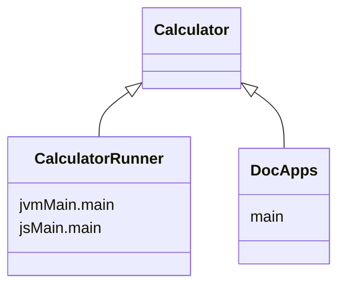

import Tabs      from '@theme/Tabs'
import TabItem   from '@theme/TabItem'
import CodeBlock from '@theme/CodeBlock';

import {DoodleCodeBlock} from '../src/components/DoodleCodeBlock';
import Gradle            from '!!raw-loader!../../Calculator/build.gradle.kts';
import RunnerGradle      from '!!raw-loader!../../CalculatorRunner/build.gradle.kts';
import {KPlayground}     from '../src/components/KotlinPlayground'

# [Calculator](https://github.com/nacular/doodle-tutorials/tree/master/Calculator) Tutorial

Our goal is to build the following calculator app using Doodle. This is a simple calculator that only
performs addition, subtraction, multiplication, and division. It also supports negative values, decimals,
and has a convenience function for converting to a percentage.

However, it does not have more advanced features, like parentheses, or other math operations. This means
the implementation is simpler, and we can focus on the way Doodle is used instead of the complexity of the
app itself. Play around with the calculator to get a feel for it.

<DoodleCodeBlock functionName="calculator" height="500" />

You can also see the full-screen app [here](https://nacular.github.io/doodle-tutorials/calculator).

---

## Project Setup

We will use a multi-platform library setup for this app, with a multiplatform launcher that depends on it.
This is not necessary to use Doodle. You could create a single multiplatform build with the common parts of your app
in `commonMain` etc.. This setup is used here because these apps are also launched by an app within `DocApps` when embedding them
like below. Therefore, we need a pure library for each app. This is why there is an app and a runner.

<Tabs>
<TabItem value="Calculator">

[**build.gradle.kts**](https://github.com/nacular/doodle-tutorials/blob/master/Calculator/build.gradle.kts)

<KPlayground>{Gradle}</KPlayground>

</TabItem>
<TabItem value="CalculatorRunner">

[**build.gradle.kts**](https://github.com/nacular/doodle-tutorials/blob/master/CalculatorRunner/build.gradle.kts)

<KPlayground>{RunnerGradle}</KPlayground>

</TabItem>
</Tabs>

---

## Defining Our Application

All Doodle apps must implement the [`Application`](https://nacular.github.io/doodle/docs/applications) interface. The framework will then initialize our app via the constructor. Our app will be fairly simple: just create an instance of our calculator and add it to the display.

Doodle apps can be defined in `commonMain`, since they do not require any platform-specific dependencies. Therefore, we will do the same and place ours in `commonMain/kotlin/io/nacular/doodle/examples`.

[**CalculatorApp.kt**](https://github.com/nacular/doodle-tutorials/blob/master/Calculator/src/commonMain/kotlin/io/nacular/doodle/examples/CalculatorApp.kt#L11)

<KPlayground>{`
package io.nacular.doodle.examples
\n
// ...
\n
class CalculatorApp(display: Display): Application {
    init {
        // creat and display a single Calculator
        display += Calculator()
    }
\n
    override fun shutdown() { /* no-op */ }
}
`}</KPlayground>

:::tip
Notice that `shutdown` is a no-op, since we don't have any cleanup to do when the app closes.
:::

---

## Launching on Web and Desktop

Doodle apps can be [launched](https://nacular.github.io/doodle/docs/applications) in a few different ways on Web and Desktop. We defined our app logic in a multi-platform `Calculator` library (no `main` functions), so it can be used on both platforms. Notice that we are only using a library here because we also want to run the Calculator in our documentation app. That app will run it as an embedded Web app, which becomes easier if it is a library. Otherwise, we could have defined our platform `main` functions directly in the `Calculator` module. Instead, we created a separate `CalculatorRunner` module that contains our `main` functions.

## Creating A Fullscreen Web App

We create a helper to launch the app in [full screen](https://nacular.github.io/doodle/docs/applications#top-level-apps).

[**FullScreen.kt**](https://github.com/nacular/doodle-tutorials/blob/master/Calculator/src/jsMain/kotlin/io/nacular/doodle/examples/FullScreen.kt#L12)

<KPlayground>{`
package io.nacular.doodle.examples
\n
//...
\n
fun fullScreen() {
    application(modules = listOf(PointerModule)) {
        // load app
        CalculatorApp(instance()) // provide the Display
    }
}
`}</KPlayground>

:::tip
Normally this would just be your `main` function, but this would prevent the app from being used as a library. Which is what happens to allow both an embedded (in the docs) and full-screen version.
:::

Use the `application` function to launch top-level apps. It takes a list of modules to and a lambda that builds the app. This lambda is within a Kodein injection context, which means we can inject dependencies into our app via `instance`, `provider`, etc.

Notice that we have included the [`PointerModule`](https://nacular.github.io/doodle/docs/pointer_input/overview). This is needed to enable mouse or pointer interactions. Our app will not directly know we loaded this module, but pointer related events will only work because we have.

:::tip
Check out Kodein to learn more about how it handles dependency injection.
:::

The `application` function also takes an optional HTML element within which the app will be hosted. The app will be hosted in
`document.body` if no element is specified.

App launching is the only part of our code that is platform-specific. This makes sense, since it is the only time we might need to know about an HTML element; say when embedding our app in a non-Doodle context.

## The Calculator View

We will implement our calculator as a single [`View`](https://nacular.github.io/doodle/docs/views) that manages its state directly. This makes sense for simple use-cases, but might not be the right choice for larger apps.

This View will be broken into a hierarchy of views, with two top-level items: a custom output and a [`GridPanel`](https://nacular.github.io/doodle/docs/ui_components/overview#gridpanel).

 

### Calculator Output

The Output will be a really simple View that tracks a number and its text representation, which it will render to the screen.
It will also expose the number as the current "answer" on the calculator. Its most complex role is displaying the text with
proper alignment and scaling to avoid any clipping.

:::tip
Notice how the output text starts off center aligned with the operator buttons; and how it shrinks as the number grows
beyond the screen size.
:::

Take a look at the [**Output**](https://github.com/nacular/doodle-tutorials/blob/master/Calculator/src/commonMain/kotlin/io/nacular/doodle/examples/Calculator.kt#L48) class, and you will see it has a `text` property that it tracks the width of. It also uses `textTransform` to perform the text scaling.

<KPlayground>{`
private inner class Output: View() {
    //...
\n
    // Transform used to scale text down as it grows beyond window width
    private var textTransform = Identity
\n
    //...
\n
    /** Text representation of number */
    var text = "0"
        set(new) {
            field = new\n
            val textWidth   = textMetrics.width(field, font)
            val windowWidth = width - inset * 2
\n
            // use transform when text grows beyond window width
            textTransform = when {
                textWidth > windowWidth -> (windowWidth/textWidth).let { Identity.scale(x = it, y = it, around = Point(width / 2, height)) }
                else                    -> Identity
            }
\n
            rerender()
        }
\n
    //...
\n
    override fun render(canvas: Canvas) {
        val textPosition = textMetrics.size(text, font).let {
            val x = when {
                textTransform.isIdentity -> width - it.width - inset
                else                     -> (width - it.width) / 2
            }
\n
            Point(x, height - it.height)
        }
\n
        // scaling, if present, is applied to the canvas before text rendered
        canvas.transform(textTransform) {
            text(text, at = textPosition, font = font, color = foregroundColor ?: White)
        }
    }
}
`}</KPlayground>

## More Dependencies

The `Output` class, and others in `Calculator` need things like fonts, and the ability to measure text. Doodle provides
these capabilities via interfaces like `FontDetector` and `TextMetrics`. These can be provided to `Calculator` via
constructor injection.

That results in a constructor as follows:

[**Calculator.kt**](https://github.com/nacular/doodle-tutorials/blob/master/Calculator/src/commonMain/kotlin/io/nacular/doodle/examples/Calculator.kt#L35)

<KPlayground>{`
class Calculator(
        private val fonts          : FontDetector,
        private val textMetrics    : TextMetrics,
        private val numberFormatter: NumberFormatter
): View() {
}
`}</KPlayground>

This means `CalculatorApp` needs to be updated as well. We continue by injecting these dependencies there as well.

<KPlayground>{`
package io.nacular.doodle.examples
\n
// ...
\n
class CalculatorApp(
        display        : Display,
        textMetrics    : TextMetrics,
        fontDetector   : FontDetector,
        numberFormatter: NumberFormatter
): Application {
    init {
        // creat and display a single Calculator
        display += Calculator(fontDetector, textMetrics, numberFormatter)
    }
\n
    override fun shutdown() { /* no-op */ }
}
`}</KPlayground>

Now `Main` needs to provide these, along with Display, when constructing the app.

<KPlayground>{`
package io.nacular.doodle.examples\n
//...\n
fun main() {
    application(modules = listOf(
        PointerModule,
        Module(name = "AppModule") {
            // Used to get fonts that should've been loaded
            bind<FontDetector>() with singleton { FontDetectorImpl(instance(), instance(), instance()) }
        }
    )) {
        // load app
        CalculatorApp(instance(), instance(), instance(), NumberFormatterImpl())
    }
}
`}</KPlayground>

:::tip
Unlike `TextMetrics`, `FontDetector` is not included in Doodle's default modules, so we have to wire it explicitly.
We define a new `Module` to do so because it has dependencies that can be injected as well.
:::

## The Buttons

We can manage the set of buttons within the calculator with a `GridPanel`. This way we get the layout support it provides.
This results in the following initialization for `Calculator`.

[**Calculator.kt**](https://github.com/nacular/doodle-tutorials/blob/master/Calculator/src/commonMain/kotlin/io/nacular/doodle/examples/Calculator.kt#L35)

<KPlayground>{`
class Calculator(/*...*/): View() {
\n
    //...
\n
    init {
        GlobalScope.launch {
            loadFonts()\n
            ButtonGroup(allowDeselectAll = true, buttons = *arrayOf(\`\u00F7\`, \`*\`, \`-\`, \`+\`))
\n
            val outputHeight  = 100.0
            val buttonSpacing =  10.0
\n
            val gridPanel = GridPanel().apply {
                add(clear, 0, 0); add(negate, 0, 1); add(\`\u00F7\`, 0, 2); add(\`\u00F7\`, 0, 3)
                add(\`7\`,   1, 0); add(\`8\`,    1, 1); add(\`9\`, 1, 2); add(\`*\`, 1, 3)
                add(\`4\`,   2, 0); add(\`5\`,    2, 1); add(\`6\`, 2, 2); add(\`-\`, 2, 3)
                add(\`1\`,   3, 0); add(\`2\`,    3, 1); add(\`3\`, 3, 2); add(\`+\`, 3, 3)
                add(\`0\`,   4, 0,  columnSpan = 2  ); add(decimal, 4, 2); add(\`=\`,  4, 3)
\n
                verticalSpacing   = buttonSpacing
                horizontalSpacing = buttonSpacing
            }
\n
            children += listOf(output, gridPanel)
\n
            // Place output outside grid so the height can be more easily controlled
            val constraints = constrain(output, gridPanel) { output, grid ->
                output.top    = parent.top
                output.left   = parent.left
                output.right  = parent.right
                output.height = constant(outputHeight)\n
                grid.top      = output.bottom + buttonSpacing
                grid.left     = output.left
                grid.right    = output.right
                grid.bottom   = parent.bottom
            }
\n
            layout = object: Layout by constraints {
                // Set total height to grid panel's ideal width and height, plus output and spacing
                override fun idealSize(container: PositionableContainer, default: Size?) = gridPanel.idealSize?.let {
                    Size(it.width, it.height + outputHeight + buttonSpacing)
                }
            }
\n
            // Force idealSize when gridPanel is laid out
            gridPanel.sizePreferencesChanged += { _,_,new ->
                idealSize = new.idealSize?.let { Size(it.width, it.height + outputHeight + buttonSpacing) }
            }
        }
    }
\n
    //...
}
`}</KPlayground>

The initialization steps are: **(1) load fonts**, **(2) setup buttons in GridPanel**, **(3) add Output and grid as children**,
**(4) configure the layout**.

This example uses non-standard/recommended property names for buttons to improve readability slightly. This also makes tests a little
simpler to understand.

## Button Styling

The calculator buttons come in a few different color schemes. But they all share the same [`Behavior`](https://nacular.github.io/doodle/docs/rendering/behaviors), defined by [`CalcButtonBehavior`](https://github.com/nacular/doodle-tutorials/blob/master/Calculator/src/commonMain/kotlin/io/nacular/doodle/examples/CalcButtonBehavior.kt#L16).
Buttons--like many Views--let you define their look-and-feel using a `Behavior`. Ours is fairly simple; it draws the rounded rectangle
for the button background and centers the text above it. These are both managed with the right color based on the button's state.
It gets state tracking and text positioning for free via its base class: `CommonTextButtonBehavior`.

## Custom Hit Detection

`CalcButtonBehavior` provides a rounded style for our buttons. But the default hit-detection for Views is tied to their rectangular
bounds. We can fix this by writing custom pointer hit-detection in our behavior.

<KPlayground>{`
class CalcButtonBehavior(textMetrics: TextMetrics): CommonTextButtonBehavior<Button>(textMetrics) {
    //...
\n
    override fun contains(view: Button, point: Point): Boolean {
        val radius      = view.height / 2
        val leftCircle  = Circle(center = Point(view.x + radius,            view.center.y), radius = radius)
        val rightCircle = Circle(center = Point(view.bounds.right - radius, view.center.y), radius = radius)
\n
        return when {
            point.x < radius              -> point in leftCircle
            point.x > view.width - radius -> point in rightCircle
            else                          -> point in view.bounds
        }
    }
}
`}</KPlayground>

The `contains(Button, Point)` method is called by `Button` to check whether the pointer is within its bounds. This logic ensures
the pointer will only "hit" our button when it goes within the rounded rectangle.

:::tip
The `contains` check provides a `Point` in the View's **parent's** coordinates.
:::

## Testing

Common code testing is one reason to use a multi-platform setup. Doodle is designed to avoid platform specific dependencies except in the
small amount of launch code. This means we can easily test `Calculator` and the other components by writing tests in `commonTest`
and running them on the JVM target. One advantage is the speed of running these tests, since there are no external dependencies.

The tests in [`CalculatorTests`](https://github.com/nacular/doodle-tutorials/blob/master/Calculator/src/commonTest/kotlin/io/nacular/doodle/examples/CalculatorTests.kt#L13)
are a bit contrived, but they illustrate how you might validate various parts of your app.