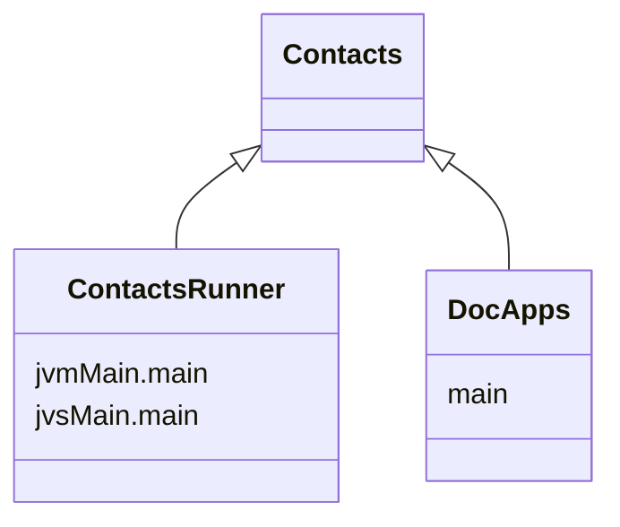

import Tabs    from '@theme/Tabs'
import TabItem from '@theme/TabItem'

import {DoodleCodeBlock} from '../src/components/DoodleCodeBlock';

# [Contacts](https://github.com/nacular/doodle-tutorials/tree/master/Contacts) Tutorial

This tutorial shows how you might build a simple app to track a list of contacts, each with a name and phone number. It is inspired by [this](https://phonebook-pi.vercel.app/), which
was built using React.

The app is built to be multiplatform and is initialized with different dependencies based on the hosting situation.
For example, the one embedded in these docs does not support deep linking, as the router used is a memory only implementation.
The full screen, Web version does support deep links though. This works seamlessly, as the app itself is unaware of the implementation
details of its dependencies.

<DoodleCodeBlock functionName="contacts" height="700" />

:::tip
You can also see the full-screen app [here](https://nacular.github.io/doodle-tutorials/contacs).
:::

---

## Project Setup

This app (like the others in this tutorial) is created as a multi-platform library, with a multiplatform launcher that depends on it.
This is not necessary to use Doodle. You could create a single multiplatform build with the common parts of your app
in `commonMain` etc.. This setup is used here because the app are also launched by an app within `DocApps` when embedding it
like below. Therefore, we need a pure library for the app. This is why there is an app and a runner.



<Tabs>
<TabItem value="app" label="Contacts">

[**build.gradle.kts**](https://github.com/nacular/doodle-tutorials/blob/master/Contacts/build.gradle.kts)

```kotlin title="build.gradle.kts"
plugins {
    kotlin("multiplatform"       )
    kotlin("plugin.serialization")
}

kotlin {
    jsTargets ()
    jvmTargets()

    val kodeinVersion       : String by project
    val doodleVersion       : String by project
    val coroutinesVersion   : String by project
    val serializationVersion: String by project

    sourceSets {
        val commonMain by getting {
            dependencies {
                implementation(kotlin("stdlib-common"))
                api("org.jetbrains.kotlinx:kotlinx-coroutines-core:$coroutinesVersion")
                api("org.jetbrains.kotlinx:kotlinx-serialization-json:$serializationVersion")
                api("org.kodein.di:kodein-di:$kodeinVersion")

                api("io.nacular.doodle:core:$doodleVersion"    )
                api("io.nacular.doodle:controls:$doodleVersion")
                api("io.nacular.doodle:themes:$doodleVersion")
                api("io.nacular.doodle:animation:$doodleVersion")

                api(project(":Modal"))
            }
        }
    }
}
```

</TabItem>
<TabItem value="runner" label="ContactsRunner">

[**build.gradle.kts**](https://github.com/nacular/doodle-tutorials/blob/master/ContactsRunner/build.gradle.kts)

```kotlin title="build.gradle.kts"
plugins {
    kotlin("multiplatform")
    application
}

kotlin {
    js().browser()

    jvm {
        withJava()
        compilations.all {
            kotlinOptions {
                jvmTarget = "11"
            }
        }
    }

    val doodleVersion: String by project

    sourceSets {
        val commonMain by getting {
            dependencies {
                implementation(project(":Contacts"))
            }
        }

        val jsMain by getting {
            dependencies {
                implementation("io.nacular.doodle:browser:$doodleVersion")
            }
        }

        val jvmMain by getting {
            dependencies {
                val osName = System.getProperty("os.name")
                val targetOs = when {
                    osName == "Mac OS X"       -> "macos"
                    osName.startsWith("Win"  ) -> "windows"
                    osName.startsWith("Linux") -> "linux"
                    else                       -> error("Unsupported OS: $osName")
                }

                val osArch = System.getProperty("os.arch")
                val targetArch = when (osArch) {
                    "x86_64", "amd64" -> "x64"
                    "aarch64"         -> "arm64"
                    else              -> error("Unsupported arch: $osArch")
                }

                val target = "${targetOs}-${targetArch}"

                implementation("io.nacular.doodle:desktop-jvm-$target:$doodleVersion")
            }
        }
    }
}

application {
    mainClass.set("MainKt")
}
```

</TabItem>
</Tabs>

---

## The Application

ContactsApp is the entry point into our application. This is where the general structure of our app is defined. Note that Doodle creates all apps
via constructor and passes their dependencies that way. This means the ContactsApp can begin work on setting up its views, layout, and routing
directly in `init`.


[**ContactsApp.kt**](https://github.com/nacular/doodle-tutorials/blob/master/Contacts/src/commonMain/kotlin/io/nacular/doodle/examples/contacts/ContactsApp.kt#L19)

```kotlin title="ContactsApp.kt"
class ContactsApp(/*...*/): Application {

    // ...

    init {
        // Coroutine used to load assets
        appScope.launch(uiDispatcher) {
            val appAssets = assets()

            themeManager.selected = theme // Install theme

            header      = Header     (appAssets)
            contactList = ContactList(appAssets)

            // Register handlers for different routes
            router[""                      ] = { _,_        -> /* Contact List     */ }
            router["/add"                  ] = { _,_        -> /* Contact Creation */ }
            router["/contact/([0-9]+)"     ] = { _, matches -> /* Contact          */ }
            router["/contact/([0-9]+)/edit"] = { _, matches -> /* Contact Editing  */ }

            display += header

            // Happens after header is added to ensure view goes below create button
            router.fireAction()

            display += CreateButton(appAssets)

            // Setup layout that manages how Header, CreateButton, and current View are positioned
            display.layout = simpleLayout { container ->
                // ...
            }

            display.fill(appAssets.background.paint)
        }
    }

    // ...

    override fun shutdown() { /* no-op */ }
}
```

:::tip
Notice that `shutdown` is a no-op, since we don't have any cleanup to do when the app closes.
:::

### Async Assets

The app uses custom fonts and images, both of which require async loading via `FontLoader` and `ImageLoader`. It is easiest to load these within
the app itself (instead of trying to load them in the launcher and injecting). We are using the `AppConfig` interface to hold these assets and many different
app attributes. The ContactsApp therefore needs to create an instance of this config, which must happen asynchronously since it internally loads
fonts and images. This is what the `assets` factory does, and why the app needs a `CoroutineScope` and `CoroutineDispatcher` injected.

```kotlin title="ContactsApp.kt"
class ContactsApp(
    // ...
    assets      : suspend () -> AppConfig,
    appScope    : CoroutineScope,
    uiDispatcher: CoroutineDispatcher,
    // ...
): Application {
    // ...
    init {
        appScope.launch(uiDispatcher) {
            val appAssets = assets()
            // ...
        }
    }

    // ...
}
```

Our launcher creates the `appScope` ahead of app creation and injects it, along with `Dispatchers.UI`.

```kotlin title="main.kt"
fun main() {
    // ...
    val appScope = CoroutineScope(SupervisorJob() + kotlinx.coroutines.Dispatchers.Default)

    application (modules = listOf(
        // ...
    )) {
        // load app
        ContactsApp(
            // ...
            appScope     = appScope
            uiDispatcher = Dispatchers.UI,
            // ...
        )
    }
}
```

### Theming

Like most apps, we will use Views that rely on `Behaviors` to control their look and feel. This includes things like `TextField`, `Label`, `ScrollPanel`,
and `HyperLink`. Therefore, we need to either provide these behaviors directly to each View, or use a `Theme` that automatically binds behaviors to
them. The latter approach is much simpler.

In this case, we use the following behaviors by installing `Module`s when initializing the app.

```kotlin title="main.kt"
fun main() {
    // ...

    application (modules = listOf(
        // ...
        basicLabelBehavior       (),
        nativeTextFieldBehavior  (spellCheck = false),
        nativeHyperLinkBehavior  (),
        nativeScrollPanelBehavior(),
        // ...
    )) {
        // load app
        ContactsApp(
            // ...
            theme        = instance(), // automatically available b/c Behavior modules installed
            themeManager = instance(), // automatically available b/c Behavior modules installed
            // ...
        )
    }
}
```

:::info
Notice that we also install `Module`s to get support for fonts, images, pointer, keyboard and others.
:::

The `Behavior` `Module`s used can be consumed in our app via the `DynamicTheme` instance. This theme picks up all registered behaviors and
installs them to the View type they are supposed to bind to. We can therefore inject this Theme and a `ThemeManager` into the app's constructor.

```kotlin title="ContactsApp.kt"
class ContactsApp(
    // ...
    theme       : DynamicTheme,
    themeManager: ThemeManager,
    // ...
): Application {
    // ...
    init {
        appScope.launch(uiDispatcher) {
            // ...
            themeManager.selected = theme // Install theme
            // ...
        }
    }

    // ...
}
```

### Routing

This app relies on navigation and routes to display various screens. The Web (full screen) version supports deep linking as a result. The mapping between
various routes and handlers is established in the `ContactsApp`.

```kotlin title="ContactsApp.kt"
class ContactsApp(
    // ...
    router: Router,
    // ...
): Application {
    // ...
    init {
        appScope.launch(uiDispatcher) {
            // ...

            // Register handlers for different routes
            router[""                      ] = { _,_        -> /* Contact List     */ }
            router["/add"                  ] = { _,_        -> /* Contact Creation */ }
            router["/contact/([0-9]+)"     ] = { _, matches -> /* Contact          */ }
            router["/contact/([0-9]+)/edit"] = { _, matches -> /* Contact Editing  */ }

            // ...
        }
    }

    // ...
}
```
:::info
The `Router` interface supports registration of handlers by regex strings. This allows for routes that contain variable data.
:::

### Responsive Layout

The app has 3 top-level Views that are visible at all times. The Header, Main View, and Create Button. These are all placed within the `Display`, and
are positioned, sized according to the `Layout` the app sets for the `Display`. That layout looks like this:

```kotlin title="ContactsApp.kt"
class ContactsApp(
    // ...
    display: Display,
    // ...
): Application {
    // ...
    init {
        appScope.launch(uiDispatcher) {
            // ...

            display.layout = simpleLayout { container ->
                val mainView = container.children[1]
                val button   = container.children[2]

                header.size     = Size(container.width, if (container.width > header.filterRightAboveWidth) header.naturalHeight else header.narrowHeight)
                mainView.bounds = Rectangle(INSET, header.height, header.width - 2 * INSET, container.height - header.height)

                button.bounds = when {
                    container.width > header.filterCenterAboveWidth -> Rectangle(container.width - appAssets.createButtonLargeSize.width - 20, (header.naturalHeight - appAssets.createButtonLargeSize.height) / 2, appAssets.createButtonLargeSize.width, appAssets.createButtonLargeSize.height)
                    else                                            -> Rectangle(container.width - appAssets.createButtonSmallSize.width - 20, container.height - appAssets.createButtonSmallSize.height - 40,      appAssets.createButtonSmallSize.width, appAssets.createButtonSmallSize.height)
                }
            }

            // ...
        }
    }

    // ...
}
```

The Header is placed at the top and allowed to resize based on the `Display`'s width. This is where we control the rules about when the `Header` becomes
compact. The main View is always seated below the Header and takes the remaining space within the `Display`.

Notice that the Create Button is a floating View. It is aligned to the right of the Header when there is sufficient space, but pops down to the bottom-right
when the app's width is below a threshold. The Header and other Views also adapt their internal layouts based on the app's width

:::tip
The Create Button needs to be above all other Views, so the app ensures it is added to the `Display` last.
:::

---

## Main Views

### Contact List

This is the main view within the app. It displays a list of contacts in a `Table`. The `Table` has 3 columns: _Name_, _Phone Number_, and an untitled
one to hold the edit/delete tool buttons.


This View is defined by `ContactList`, which extends Doodle's `DynamicTable`. These tables respond automatically when their models change, which is
what we need given Contacts will be added, edited, and deleted.

```kotlin title="ContactList.kt"
class ContactList(
   // ...
): DynamicTable<Contact, MutableListModel<Contact>>(contacts, SingleItemSelectionModel(), block = {
    // Specifies alignment for the table's cells
    val alignment: Constraints.() -> Unit = {
        left    = parent.left + INSET
        centerY = parent.centerY
    }

    // Used to render the name column
    val nameVisualizer = object: CellVisualizer<Contact, String> {
        override fun invoke(item: String, previous: View?, context: CellInfo<Contact, String>) = when (previous) {
            is NameCell -> previous.also { it.update(item) }
            else        -> NameCell(textMetrics, item)
        }
    }

    // Used to render the edit/delete column
    val toolsVisualizer = object: CellVisualizer<Contact, Unit> {
        override fun invoke(item: Unit, previous: View?, context: CellInfo<Contact, Unit>) = when (previous) {
            is ToolCell -> previous.also { it.update(context.selected) }
            else        -> ToolCell(assets, pathMetrics, context.selected).apply {
                onDelete = {
                    appScope.launch(uiDispatcher) {
                        if (modals.confirmDelete(assets, context.item).show()) {
                            contacts.remove(context.item)
                        }
                    }
                }
                onEdit = { navigator.showContactEdit(context.item) }
            }
        }
    }

    column(Label("Name"        ), { name        }, nameVisualizer   ) { cellAlignment = alignment; headerAlignment = alignment                }
    column(Label("Phone Number"), { phoneNumber }, TextVisualizer() ) { cellAlignment = alignment; headerAlignment = alignment                }
    column(null,                                   toolsVisualizer  ) { cellAlignment = fill(Insets(top = 20.0, bottom = 20.0, right = 20.0)) }
}) {
    init {
        font = assets.small

        // Controls how the table's columns resize
        columnSizePolicy = object: ColumnSizePolicy {
            override fun layout(width: Double, columns: List<Column>, startIndex: Int): Double {
                columns[2].width = if (width > 672.0 - 2 * INSET) 100.0 else 0.0 // FIXME: factor out hard-coded width
                columns[0].width = width / 2
                columns[1].width = width - columns[0].width - columns[2].width

                return width
            }

            override fun widthChanged(width: Double, columns: List<Column>, index: Int, to: Double) {
                // no-op
            }
        }

        behavior      = ContactListBehavior(assets, navigator)
        acceptsThemes = false
    }
}

// ...
```

Here you can see the table's columns are defined (at construction time), and the sizing policy for their widths is specified. `Table`s are all
strongly-typed, so this one can only store `Contacts`. Which means each column can be derived from some component of a Contact. The first two
rely on `name` and `phoneNumber` respectively. But the last column takes no data in, since it will simply show buttons that fire events.

### Contact Creation

### Contact Editing

### Contact View