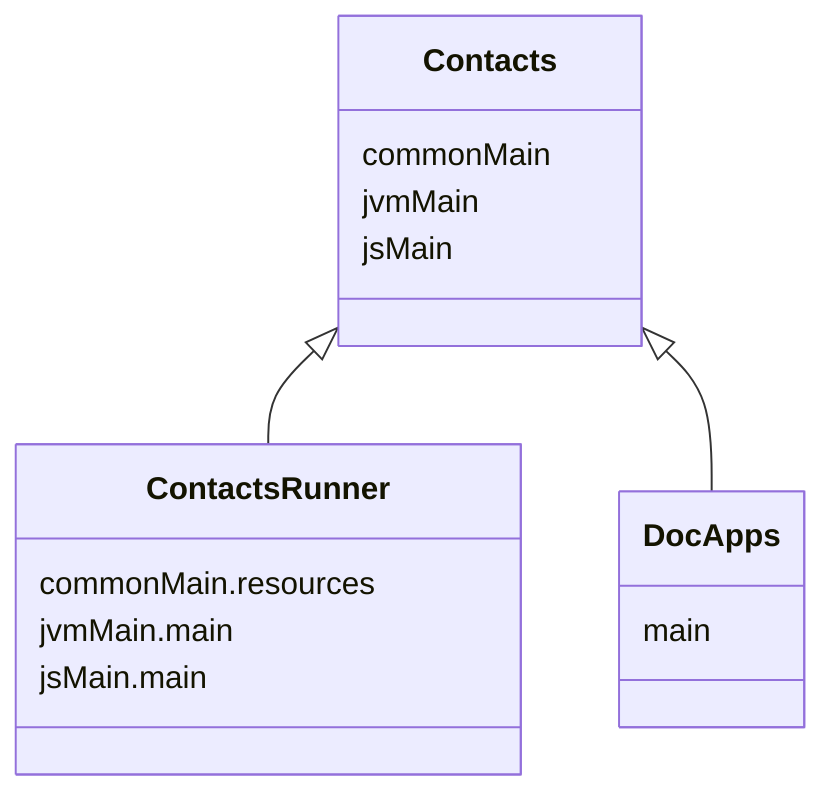

import Tabs    from '@theme/Tabs'
import TabItem from '@theme/TabItem'

import {DoodleCodeBlock} from '../src/components/DoodleCodeBlock';

# [Contacts](https://github.com/nacular/doodle-tutorials/tree/master/Contacts) Tutorial

This tutorial shows how you might build a simple app to track a list of contacts, each with a name and phone number. It is inspired by [phonebook-pi.vercel.app](https://phonebook-pi.vercel.app/), which
was built using React.

The app is multiplatform and is initialized with different dependencies based on the hosting situation.
For example, the one embedded in these docs does not support deep linking, as the router used is a memory only implementation.
The full screen, Web version does support deep links though. This works seamlessly, as the app itself is unaware of the implementation
details of its dependencies.

<DoodleCodeBlock functionName="contacts" height="700" />

:::tip
You can also see the full-screen app [here](https://nacular.github.io/doodle-tutorials/contacs).
:::

---

## Project Setup

This app (like the others in this tutorial) is created as a multi-platform library, with a multiplatform launcher that depends on it.
This is not necessary to use Doodle. You could create a single multiplatform build with the common parts of your app
in `commonMain` etc.. This setup is used here because the app are also launched by an app within `DocApps` when embedding it
like below. Therefore, we need a pure library for the app. This is why there is an app and a runner.



<Tabs>
<TabItem value="app" label="Contacts">

[**build.gradle.kts**](https://github.com/nacular/doodle-tutorials/blob/master/Contacts/build.gradle.kts)

```kotlin title="build.gradle.kts"
plugins {
    kotlin("multiplatform"       )
    kotlin("plugin.serialization")
}

kotlin {
    jsTargets ()
    jvmTargets()

    val kodeinVersion       : String by project
    val doodleVersion       : String by project
    val coroutinesVersion   : String by project
    val serializationVersion: String by project

    sourceSets {
        val commonMain by getting {
            dependencies {
                implementation(kotlin("stdlib-common"))
                api("org.jetbrains.kotlinx:kotlinx-coroutines-core:$coroutinesVersion")
                api("org.jetbrains.kotlinx:kotlinx-serialization-json:$serializationVersion")
                api("org.kodein.di:kodein-di:$kodeinVersion")

                api("io.nacular.doodle:core:$doodleVersion"    )
                api("io.nacular.doodle:controls:$doodleVersion")
                api("io.nacular.doodle:themes:$doodleVersion")
                api("io.nacular.doodle:animation:$doodleVersion")

                api(project(":Modal"))
            }
        }
    }
}
```

</TabItem>
<TabItem value="runner" label="ContactsRunner">

[**build.gradle.kts**](https://github.com/nacular/doodle-tutorials/blob/master/ContactsRunner/build.gradle.kts)

```kotlin title="build.gradle.kts"
plugins {
    kotlin("multiplatform")
    application
}

kotlin {
    js().browser()

    jvm {
        withJava()
        compilations.all {
            kotlinOptions {
                jvmTarget = "11"
            }
        }
    }

    val doodleVersion: String by project

    sourceSets {
        val commonMain by getting {
            dependencies {
                implementation(project(":Contacts"))
            }
        }

        val jsMain by getting {
            dependencies {
                implementation("io.nacular.doodle:browser:$doodleVersion")
            }
        }

        val jvmMain by getting {
            dependencies {
                val osName = System.getProperty("os.name")
                val targetOs = when {
                    osName == "Mac OS X"       -> "macos"
                    osName.startsWith("Win"  ) -> "windows"
                    osName.startsWith("Linux") -> "linux"
                    else                       -> error("Unsupported OS: $osName")
                }

                val osArch = System.getProperty("os.arch")
                val targetArch = when (osArch) {
                    "x86_64", "amd64" -> "x64"
                    "aarch64"         -> "arm64"
                    else              -> error("Unsupported arch: $osArch")
                }

                val target = "${targetOs}-${targetArch}"

                implementation("io.nacular.doodle:desktop-jvm-$target:$doodleVersion")
            }
        }
    }
}

application {
    mainClass.set("MainKt")
}
```

:::warning
The desktop application uses placeholder icons in some cases to work-around a known [Skiko bug](https://github.com/JetBrains/skiko/issues/518)
related to SVG path data parsing.
:::

</TabItem>
</Tabs>

---

## The Application

[`ContactsApp`](https://github.com/nacular/doodle-tutorials/blob/master/Contacts/src/commonMain/kotlin/io/nacular/doodle/examples/contacts/ContactsApp.kt) is the entry point into our application. This is where the general structure of our app is defined. Note that Doodle creates all apps
via constructor and passes their dependencies that way. This means the ContactsApp can begin work on setting up its views, layout, and routing
directly in `init`.


[**ContactsApp.kt**](https://github.com/nacular/doodle-tutorials/blob/master/Contacts/src/commonMain/kotlin/io/nacular/doodle/examples/contacts/ContactsApp.kt#L19)

```kotlin title="ContactsApp.kt"
class ContactsApp(/*...*/): Application {

    // ...

    init {
        // Coroutine used to load assets
        appScope.launch(uiDispatcher) {
            val appAssets = assets()

            themeManager.selected = theme // Install theme

            header      = Header     (appAssets)
            contactList = ContactList(appAssets)

            // Register handlers for different routes
            router[""                      ] = { _,_        -> /* Contact List     */ }
            router["/add"                  ] = { _,_        -> /* Contact Creation */ }
            router["/contact/([0-9]+)"     ] = { _, matches -> /* Contact          */ }
            router["/contact/([0-9]+)/edit"] = { _, matches -> /* Contact Editing  */ }

            display += header

            // Happens after header is added to ensure view goes below create button
            router.fireAction()

            display += CreateButton(appAssets)

            // Setup layout that manages how Header, CreateButton, and current View are positioned
            display.layout = simpleLayout { container ->
                // ...
            }

            display.fill(appAssets.background.paint)
        }
    }

    // ...

    override fun shutdown() { /* no-op */ }
}
```

:::tip
Notice that `shutdown` is a no-op, since we don't have any cleanup to do when the app closes.
:::

### Async Assets

The app uses custom fonts and images, both of which require async loading via [`FontLoader`](https://github.com/nacular/doodle/blob/master/Core/src/commonMain/kotlin/io/nacular/doodle/drawing/FontLoader.kt#L38)
and [`ImageLoader`](https://github.com/nacular/doodle/blob/master/Core/src/commonMain/kotlin/io/nacular/doodle/image/ImageLoader.kt#L6). It is easiest to load these within
the app itself (instead of trying to load them in the launcher and injecting). We are using the `AppConfig` interface to hold these assets and many different
app attributes. The ContactsApp therefore needs to create an instance of this config, which must happen asynchronously since it internally loads
fonts and images. This is what the `assets` factory does, and why the app needs a `CoroutineScope` and `CoroutineDispatcher` injected.

```kotlin title="ContactsApp.kt"
class ContactsApp(
    // ...
    assets      : suspend () -> AppConfig,
    appScope    : CoroutineScope,
    uiDispatcher: CoroutineDispatcher,
    // ...
): Application {
    // ...
    init {
        appScope.launch(uiDispatcher) {
            val appAssets = assets()
            // ...
        }
    }

    // ...
}
```

Our launcher creates the `appScope` ahead of app creation and injects it, along with `Dispatchers.UI`
([web](https://github.com/nacular/doodle/blob/master/Browser/src/jsMain/kotlin/io/nacular/doodle/coroutines/Dispatchers.kt#L8), [desktop](https://github.com/nacular/doodle/blob/master/Desktop/src/jvmMain/kotlin/io/nacular/doodle/coroutines/Dispatchers.kt#L8)).

```kotlin title="main.kt"
fun main() {
    // ...
    val appScope = CoroutineScope(SupervisorJob() + kotlinx.coroutines.Dispatchers.Default)

    application (modules = listOf(
        // ...
    )) {
        // load app
        ContactsApp(
            // ...
            appScope     = appScope
            uiDispatcher = Dispatchers.UI,
            // ...
        )
    }
}
```

### Theming

Like most apps, we will use Views that rely on [Behaviors](https://nacular.github.io/doodle/docs/rendering/behaviors) to control their look and
feel. This includes things like [TextField](https://nacular.github.io/doodle/docs/ui_components/overview#textfield), [Label](https://nacular.github.io/doodle/docs/ui_components/overview#label),
[ScrollPanel](https://github.com/nacular/doodle/blob/master/Core/src/commonMain/kotlin/io/nacular/doodle/controls/panels/ScrollPanel.kt#L52), and
[`HyperLink`](https://github.com/nacular/doodle/blob/master/Controls/src/commonMain/kotlin/io/nacular/doodle/controls/buttons/HyperLink.kt#L9).
Therefore, we need to either provide these behaviors directly to each View, or use a [Theme](https://nacular.github.io/doodle/docs/themes) that
automatically binds behaviors to them. The latter approach is much simpler.

In this case, we use the following behaviors by installing [Modules](https://nacular.github.io/doodle/docs/applications#dependencies) when initializing the app.

```kotlin title="main.kt"
fun main() {
    // ...

    application (modules = listOf(
        // ...
        basicLabelBehavior       (),
        nativeTextFieldBehavior  (spellCheck = false),
        nativeHyperLinkBehavior  (),
        nativeScrollPanelBehavior(),
        // ...
    )) {
        // load app
        ContactsApp(
            // ...
            theme        = instance(), // automatically available b/c Behavior modules installed
            themeManager = instance(), // automatically available b/c Behavior modules installed
            // ...
        )
    }
}
```

:::info
Notice that we also install modules to get support for [fonts](https://nacular.github.io/doodle/docs/rendering/text#fonts),
[images](https://nacular.github.io/doodle/docs/rendering/images), [pointer](https://nacular.github.io/doodle/docs/pointer_input/overview),
[keyboard](https://nacular.github.io/doodle/docs/keyboard) and others.
:::

The `Behavior` modules used can be consumed in our app via the [DynamicTheme](https://nacular.github.io/doodle/docs/themes#dynamic-themes) instance.
This theme picks up all registered behaviors and installs them to the View type they are supposed to bind to. We can therefore inject this
`Theme` and a [ThemeManager](https://nacular.github.io/doodle/docs/themes#thememanager) into the app's constructor.

```kotlin title="ContactsApp.kt"
class ContactsApp(
    // ...
    theme       : DynamicTheme,
    themeManager: ThemeManager,
    // ...
): Application {
    // ...
    init {
        appScope.launch(uiDispatcher) {
            // ...
            themeManager.selected = theme // Install theme
            // ...
        }
    }

    // ...
}
```

### Routing

This app relies on navigation and routes to display various screens. The Web (full screen) version supports deep linking as a result. The mapping between
various routes and handlers is established in the [`ContactsApp`](https://github.com/nacular/doodle-tutorials/blob/master/Contacts/src/commonMain/kotlin/io/nacular/doodle/examples/contacts/ContactsApp.kt#L19).

```kotlin title="ContactsApp.kt"
class ContactsApp(
    // ...
    router: Router,
    // ...
): Application {
    // ...
    init {
        appScope.launch(uiDispatcher) {
            // ...

            // Register handlers for different routes
            router[""                      ] = { _,_        -> /* Contact List     */ }
            router["/add"                  ] = { _,_        -> /* Contact Creation */ }
            router["/contact/([0-9]+)"     ] = { _, matches -> /* Contact          */ }
            router["/contact/([0-9]+)/edit"] = { _, matches -> /* Contact Editing  */ }

            // ...
        }
    }

    // ...
}
```
:::info
The [`Router`](https://github.com/nacular/doodle-tutorials/blob/master/Contacts/src/commonMain/kotlin/io/nacular/doodle/examples/contacts/Router.kt#L9)
interface supports registration of handlers by regex strings. This allows for routes that contain variable data.
:::

### Responsive Layout

The app has 3 top-level Views that are visible at all times. The [Header](#header), main View, and Create Button. These are all placed within the
[Display](https://nacular.github.io/doodle/docs/display), and are positioned, sized according to the specified [Layout](https://nacular.github.io/doodle/docs/positioning).
That layout looks like this:

```kotlin title="ContactsApp.kt"
class ContactsApp(
    // ...
    display: Display,
    // ...
): Application {
    // ...
    init {
        appScope.launch(uiDispatcher) {
            // ...

            display.layout = object: Layout {
                // Header needs to be sized based on its minimumSize, so this layout should respond to any changes to it.
                override fun requiresLayout(
                    child: Positionable,
                    of   : PositionableContainer,
                    old  : View.SizePreferences,
                    new  : View.SizePreferences
                ) = new.minimumSize != old.minimumSize

                override fun layout(container: PositionableContainer) {
                    val mainView = container.children[1]
                    val button   = container.children[2]

                    header.size     = Size(container.width, header.minimumSize.height)
                    mainView.bounds = Rectangle(INSET, header.height, max(0.0, header.width - 2 * INSET), max(0.0, container.height - header.height))

                    button.bounds = when {
                        container.width > header.filterCenterAboveWidth -> Rectangle(container.width - appAssets.createButtonLargeSize.width - 20, (header.naturalHeight - appAssets.createButtonLargeSize.height) / 2, appAssets.createButtonLargeSize.width, appAssets.createButtonLargeSize.height)
                        else                                            -> Rectangle(container.width - appAssets.createButtonSmallSize.width - 20, container.height - appAssets.createButtonSmallSize.height - 40,      appAssets.createButtonSmallSize.width, appAssets.createButtonSmallSize.height)
                    }
                }
            }

            // ...
        }
    }

    // ...
}
```

The Header is placed at the top and allowed to resize based on the `Display`'s width. The header will update its `minimumSize` and `idealSize` based
on its width, which in turn will trigger a re-layout (see `requiresLayout` above). The main View is always seated below the Header and takes the
remaining space within the `Display`.

Notice that the Create Button is a floating View. It is aligned to the right of the Header when there is sufficient space, but pops down to the
bottom-right when the app's width is below a threshold. The Header and other Views also adapt their internal layouts based on the app's width

:::tip
The Create Button needs to be above all other Views, so the app ensures it is added to the `Display` last.
:::

---

## Main Views

### [Header](https://github.com/nacular/doodle-tutorials/blob/master/Contacts/src/commonMain/kotlin/io/nacular/doodle/examples/contacts/Header.kt#L35)

The app's header (which is always visible) provides a way to [filter](#filterbox) the [Contact List](#contact-list)
and navigate back to it whenever the logo area is clicked. It also positions its contents in a way that allows the floating create button to sit along side them as though it is a child.

<DoodleCodeBlock functionName="contactsHeader" height="200" />

```kotlin title="Header.kt"
class Header(/*...*/): View() {

    /** Search box that filters which contacts are shown */
    private inner class FilterBox: View() {
        // ...
    }

            val naturalHeight          =  64.0
    private val filterRightAboveWidth  = 672.0
    private val filterCenterAboveWidth = 800.0
    private val filterBox: FilterBox

    val filterCentered: Boolean get() = width > filterCenterAboveWidth

    var searchEnabled by observable(true) { _,new ->
        filterBox.enabled = new
    }

    init {
        children += Photo(assets.logo).apply { size = Size(40) }
        children += Label("Phonebook").apply {
            font            = assets.large
            behavior        = CommonLabelBehavior(textMetrics)
            acceptsThemes   = false
            foregroundColor = assets.header
        }
        children += FilterBox().apply { size = Size(300, 45); font = assets.medium }.also { filterBox = it }

        val filterNaturalWidth = 300.0

        layout = Layout.simpleLayout { container ->
            val logo   = container.children[0]
            val label  = container.children[1]
            val filter = container.children[2]

            logo.position  = Point(2 * INSET, (naturalHeight - logo.height) / 2)
            label.position = Point(logo.bounds.right + 10, logo.bounds.center.y - label.height / 2)

            filter.bounds = when {
                container.width > filterCenterAboveWidth -> Rectangle((container.width - filterNaturalWidth) / 2,        logo.bounds.center.y - filter.height / 2, filterNaturalWidth, filter.height)
                container.width > filterRightAboveWidth  -> Rectangle( container.width - filterNaturalWidth - 2 * INSET, logo.bounds.center.y - filter.height / 2, filterNaturalWidth, filter.height)
                else                                     -> Rectangle(logo.x, logo.bounds.bottom + INSET, max(0.0, container.width - 4 * INSET), filter.height)
            }
        }.then {
            minimumSize = Size(width, max(0.0, filterBox.bounds.bottom + 8))
            idealSize   = minimumSize
        }

        // Custom cursor when pointer in the "clickable" region
        pointerMotionChanged += moved {
            cursor = when {
                it.inHotspot -> Pointer
                else         -> null
            }
        }

        // Show Contact list when "clickable" region clicked
        pointerChanged += clicked {
            if (it.inHotspot) {
                navigator.showContactList()
            }
        }
    }

    private val PointerEvent.inHotspot get() = this@Header.toLocal(location, target).x < 220
}
```

:::tip
The Header uses pointer tracking to update its Cursor and handle clicking within its hot spot.
:::

#### FilterBox

The FilterBox is a simple wrapper around a [TextField](https://nacular.github.io/doodle/docs/ui_components/overview#textfield)
that adds some iconography, handles styling and manages the animations.

```kotlin
private inner class FilterBox: View() {

    private var progress              by renderProperty(0f  )
    private var animation: Animation? by observable    (null) { old,_ -> old?.cancel() }

    private val searchIcon     = PathIcon<View>(path(assets.searchIcon), fill = assets.search, pathMetrics = pathMetrics)
    private val searchIconSize = searchIcon.size(this)

    val textField = TextField().apply {
        placeHolder      = "Search"
        borderVisible    = false
        backgroundColor  = Transparent
        placeHolderColor = assets.placeHolder
        focusChanged    += { _,_,hasFocus ->
            // animate progress based on focus state
            animation = (animate (progress to if (hasFocus) 1f else 0f) using assets.slowTransition) {
                progress = it
            }
        }
    }

    init {
        cursor             = Text
        clipCanvasToBounds = false

        val clearButton = PathIconButton(pathData = assets.deleteIcon, pathMetrics = pathMetrics).apply {
            size            = Size(22, 44)
            cursor          = Pointer
            visible         = textField.text.isNotBlank()
            foregroundColor = assets.search
            fired += {
                textField.text = ""
            }
        }

        textField.textChanged += { _,_,new ->
            when {
                new.isBlank() -> contacts.filter = null
                else          -> contacts.filter = { it.name.contains(new, ignoreCase = true) }
            }

            clearButton.visible = new.isNotBlank()
        }

        children += textField
        children += clearButton

        layout = constrain(children[0], children[1]) { textField, clear ->
            textField.left    = parent.left + searchIconSize.width + 2 * 20
            textField.height  = parent.height
            textField.right   = clear.left
            textField.centerY = parent.centerY
            clear.right       = parent.right - 20
            clear.centerY     = parent.centerY
        }

        pointerChanged += clicked {
            focusManager.requestFocus(textField)
        }
    }

    override fun render(canvas: Canvas) {
        when {
            // draw shadow when animating (progress > 0)
            progress > 0f -> canvas.outerShadow(horizontal = 0.0, vertical = 4.0 * progress, color = assets.shadow, blurRadius = 3.0 * progress) {
                // interpolate color during animation
                canvas.rect(bounds.atOrigin, radius = 8.0, color = interpolate(assets.searchSelected, assets.background, progress))
            }
            else          -> canvas.rect(bounds.atOrigin, radius = 8.0, color = assets.searchSelected)
        }

        searchIcon.render(this, canvas, at = Point(20.0, (height - searchIconSize.height) / 2))
    }
}
```

### [Contact List](https://github.com/nacular/doodle-tutorials/blob/master/Contacts/src/commonMain/kotlin/io/nacular/doodle/examples/contacts/ContactList.kt#L35)

This is the main view within the app. It displays the contacts in a [Table](https://nacular.github.io/doodle/docs/ui_components/overview#table) with
three columns: _Name_, _Phone Number_, and an untitled one to hold the edit/delete tool buttons. This View extends Doodle's
[`DynamicTable`](https://github.com/nacular/doodle/blob/master/Controls/src/commonMain/kotlin/io/nacular/doodle/controls/table/DynamicTable.kt#L65),
which means it responds automatically to change in its underlying model. This is precisely what we need since Contacts will be added, edited, and
deleted.

<DoodleCodeBlock functionName="contactList" height="550" />

```kotlin title="ContactList.kt"
class ContactList(
   // ...
): DynamicTable<Contact, MutableListModel<Contact>>(contacts, SingleItemSelectionModel(), block = {
    val alignment      : Constraints.() -> Unit          = // ...
    val nameVisualizer : CellVisualizer<Contact, String> = // ...
    val toolsVisualizer: CellVisualizer<Contact, Unit>   = // ...

    column(Label("Name"        ), { name        }, nameVisualizer   ) { cellAlignment = alignment; headerAlignment = alignment                }
    column(Label("Phone Number"), { phoneNumber }, TextVisualizer() ) { cellAlignment = alignment; headerAlignment = alignment                }
    column(null,                                   toolsVisualizer  ) { cellAlignment = fill(Insets(top = 20.0, bottom = 20.0, right = 20.0)) }
}) {
    init {
        // ...

        // Controls how the table's columns resize
        columnSizePolicy = object: ColumnSizePolicy {
            override fun layout(width: Double, columns: List<Column>, startIndex: Int): Double {
                columns[2].width = if (width > 672.0 - 2 * INSET) 100.0 else 0.0 // FIXME: factor out hard-coded width
                columns[0].width = width / 2
                columns[1].width = width - columns[0].width - columns[2].width

                return width
            }

            override fun widthChanged(width: Double, columns: List<Column>, index: Int, to: Double) {
                // no-op
            }
        }

        behavior      = ContactListBehavior(assets, navigator)
        acceptsThemes = false
    }
}

// ...
```

:::tip
ContactList uses a [`SingleItemSelectionModel`](https://github.com/nacular/doodle/blob/master/Controls/src/commonMain/kotlin/io/nacular/doodle/controls/SelectionModel.kt#L117)
to ensure that only one row can be highlighted at a time.
:::

The table's columns are defined (at construction time), and the sizing policy for their widths is specified in the `apply` block.
`Table`s are all strongly-typed, so this one can only store `Contact`s. Which means each column can derive its data from some component of
a `Contact`. The first two columns rely on `Contact.name` and `Contact.phoneNumber` respectively. But the last column takes no data in,
since it will simply show buttons that fire events.

The `columnSizePolicy` used sizes the columns so that they take up the entire table width and scale such that the 3rd one disappears when
the table is below a threshold.

#### [Custom Table Behavior](https://github.com/nacular/doodle-tutorials/blob/master/Contacts/src/commonMain/kotlin/io/nacular/doodle/examples/contacts/ContactListBehavior.kt#L29)

The `ContactList` uses a custom [`TableBehavior`](https://github.com/nacular/doodle/blob/master/Controls/src/commonMain/kotlin/io/nacular/doodle/controls/table/TableBehavior.kt#L135)
via `ContactListBehavior`. Doodle's [Table](https://nacular.github.io/doodle/docs/ui_components/overview#table) is very customizable, since it
delegates a lot of functionality to `TableBehavior`. We use this fact to specify how the header and body cells look and are positioned, as well as
the way selection highlighting works.

```kotlin title="ContactListBehavior.kt"
class ContactListBehavior(private val assets: AppConfig, private val navigator: Navigator): TableBehavior<Contact>() {
    private inner class ContactCell<T>(/*...*/): View() {
        // Represents each cell in the table's body
        // Navigates to ContactView on pointer press
        // Adds/removes row selection (for highlighting) on pointer enter/exit
    }

    private val selectionChanged: SetObserver<Table<Contact, *>, Int> = { table,_,_ ->
        // Repaint the Table to show selected rows
        table.bodyDirty()
    }

    override fun install(view: Table<Contact, *>) {
        view.selectionChanged += selectionChanged
    }

    override fun uninstall(view: Table<Contact, *>) {
        view.selectionChanged -= selectionChanged
    }

    override val headerCellGenerator = object: AbstractTableBehavior.HeaderCellGenerator<Table<Contact, *>> {
        override fun <A> invoke(table: Table<Contact, *>, column: Column<A>) = container {
            // Column header cell with underline
        }
    }

    override val headerPositioner = object: AbstractTableBehavior.HeaderPositioner<Table<Contact, *>> {
        override fun invoke(table: Table<Contact, *>) = HeaderGeometry(0.0, TABLE_HEADER_HEIGHT)
    }

    // No overflow column will be in the Table
    override val overflowColumnConfig: Nothing? = null

    @Suppress("UNCHECKED_CAST")
    override val cellGenerator: CellGenerator<Contact> = object: CellGenerator<Contact> {
        override fun <A> invoke(table: Table<Contact, *>, column: Column<A>, cell: A, row: Int, itemGenerator: ItemVisualizer<A, IndexedItem>, current: View?): View = when (current) {
            is ContactCell<*> -> (current as ContactCell<A>).apply { update(table, cell, row) }
            else              -> ContactCell(table, column, cell, row, itemGenerator)
        }
    }

    override val rowPositioner: RowPositioner<Contact> = object: RowPositioner<Contact> {
        // Position rows like a vertical list
        private val delegate = VerticalListPositioner(ROW_HEIGHT)

        override fun rowBounds  (of: Table<Contact, *>, row: Contact, index: Int) = delegate.itemBounds (of.size,     of.insets, index)
        override fun row        (of: Table<Contact, *>, at: Point               ) = delegate.itemFor    (of.size,     of.insets,  at  )
        override fun minimumSize(of: Table<Contact, *>                          ) = delegate.minimumSize(of.numItems, of.insets       )
    }

    override fun renderBody(table: Table<Contact, *>, canvas: Canvas) {
        canvas.rect(table.bounds.atOrigin, color = assets.background)

        // Highlight selected rows
        table.selection.map { it to table[it] }.forEach { (index, row) ->
            row.onSuccess {
                canvas.rect(rowPositioner.rowBounds(table, it, index).inset(Insets(top = 1.0)), assets.listHighlight)
            }
        }
    }
}
```

:::tip
Highlighting on pointer hover is handled by each cell in the Table. [`ContactCell`](https://github.com/nacular/doodle-tutorials/blob/master/Contacts/src/commonMain/kotlin/io/nacular/doodle/examples/contacts/ContactListBehavior.kt#L29)
registers Pointer/MotionListeners and sets its row un/selected accordingly. This then results in `ContactListBehavior` redrawing the
Table background and coloring the selected rows.
:::

### [Contact Creation](https://github.com/nacular/doodle-tutorials/blob/master/Contacts/src/commonMain/kotlin/io/nacular/doodle/examples/contacts/CreateContactView.kt#L24)

This View allows the user to create a new contact. It shows a preview of the avatar that will be used and takes text input for both the `name` and
`phoneNumber`. This View uses child Views for these components, including a [Form](https://nacular.github.io/doodle/docs/ui_components/form) for the input fields.

<DoodleCodeBlock functionName="contactCreation" height="550" />

```kotlin title="CreateContactView.kt"
class CreateContactView(
    // ...
): View() {
    private inner class DynamicAvatar(private val image: Image): Avatar(textMetrics, "") {
        override fun render(canvas: Canvas) {
            when {
                name.isBlank() -> canvas.clip(Circle(radius = min(width, height) / 2, center = Point(width / 2, height / 2))) {
                    canvas.image(image, destination = bounds.atOrigin)
                }
                else -> super.render(canvas)
            }
        }
    }

    init {
        lateinit var name       : String
        lateinit var phoneNumber: String

        val label = Label("Create Contact").apply {
            font    = assets.medium
            height  = 28.0
            fitText = setOf(Width)
        }

        val back   = buttons.back  (assets.backIcon)
        val avatar = DynamicAvatar (assets.blankAvatar).apply { size = Size(176); font = assets.medium }
        val button = buttons.create(assets.buttonBackground, assets.buttonForeground).apply {
            font     = assets.small
            enabled  = false
            fired   += {
                contacts += Contact(name, phoneNumber)
                navigator.showContactList()
            }
        }

        val spacer = view {
            height = 64.0
            render = {
                line(Point(0.0, height / 2), Point(width, height / 2), stroke = Stroke(assets.outline))
            }
        }

        val form = editForm(
            assets          = assets,
            button          = button,
            pathMetrics     = pathMetrics,
            nameChanged     = { avatar.name = it },
            textFieldStyler = textFieldStyler
        ) { name_, phone_ ->
            name           = name_
            phoneNumber    = phone_
            button.enabled = true
        }

        children += listOf(label, back, avatar, spacer, form, button)

        layout = constrain(label, back, avatar, spacer, form, button) { (label, back, avatar, spacer, form, button) ->
            // ...
        }.then {
            idealSize = Size(spacer.width + 2 * INSET, button.bounds.bottom + INSET)
        }
    }

    // Helper to use constrain with 6 items
    private operator fun <T> List<T>.component6() = this[5]
}
```

### Contact View

This View shows the details of a contact. It allows the user to edit or delete the contact. Editing jumps to the [Contact Editing](#contact-editing)
screen.

<DoodleCodeBlock functionName="contactView" height="550" />

```kotlin title="ContactView.kt"
class ContactView(/*...*/): ContactCommon(/*...*/) {
    init {
        edit.apply {
            fired += {
                // Show Contact edit when pressed
                navigator.showContactEdit(super.contact)
            }
        }

        val details = container {
            this += Label("Contact Details").apply {
                font    = assets.small
                height  = 24.0
                fitText = setOf(Width)
            }
            this += HyperLink(
                url  = "tel:${contact.phoneNumber}",
                text = contact.phoneNumber,
                icon = PathIcon(path = path(assets.phoneIcon), pathMetrics = pathMetrics, fill = assets.phoneNumber),
            ).apply {
                font            = assets.small
                acceptsThemes   = false
                iconTextSpacing = INSET
                behavior        = linkStyler(this, object: CommonTextButtonBehavior<HyperLink>(textMetrics) {
                    override fun install(view: HyperLink) {
                        super.install(view)
                        val textSize = textMetrics.size(text, font)
                        val iconSize = icon!!.size(view)

                        // Ensure link's size includes icon and text
                        size = Size(textPosition(view).x + textSize.width, max(iconSize.height, textSize.height))
                    }

                    override fun render(view: HyperLink, canvas: Canvas) {
                        icon!!.render(view, canvas, at = iconPosition(view, icon = icon!!))

                        // Styled text with phoneNumberLink color and link's font
                        canvas.text(assets.phoneNumberLink.invoke { view.font(view.text) }, at = textPosition(view))
                    }
                }) as Behavior<Button>
            }

            render = {
                rect(bounds.atOrigin.inset(0.5), radius = 12.0, stroke = Stroke(assets.outline))
            }

            layout = constrain(children[0], children[1]) { label, link ->
                label.top  = parent.top   + INSET
                label.left = parent.left  + INSET
                link.top   = label.bottom + INSET
                link.left  = label.left
            }
        }

        setDetail(details)

        layout = simpleLayout { layoutCommonItems() }.then {
            idealSize = Size(spacer.width + 2 * INSET, details.bounds.bottom + INSET)
        }
    }
}
```

:::tip
This view uses a customized HyperLink that contains an icon. HyperLinks are Buttons whose behaviors can be modified. In this case, we want the link
to behave like a normal link, but fully customize the rendering. This is why we need to use `linkStyler`, which is a [`NativeHyperLinkStyler`](https://github.com/nacular/doodle/blob/master/Themes/src/commonMain/kotlin/io/nacular/doodle/theme/native/NativeHyperLinkBehavior.kt#L7).
:::

### Contact Editing

Contacts are edited using this View. It is fairly similar to the CreateContactView, in that it displays the contact's avatar, `name`, `phoneNumber`,
and presents a form to modify them. It also has a delete button to remove the Contact. This View shares a lot of structure with `ContactView` that
is placed in the `ContactCommon` base class.

<DoodleCodeBlock functionName="contactEditing" height="600" />

```kotlin title="EditContactView.kt"
class EditContactView(
    // ...
): ContactCommon(
    // ...
) {
    init {
        lateinit var newName       : String
        lateinit var newPhoneNumber: String

        edit.apply {
            enabled = false
            fired += {
                // tries to edit its contact
                contacts.edit(super.contact) {
                    name        = newName
                    phoneNumber = newPhoneNumber
                }.onSuccess {
                    super.contact = it // updates its contact to the newly edited one
                }

                enabled = false
            }
        }

        val form = editForm(super.contact.name, super.contact.phoneNumber, assets, textFieldStyler, pathMetrics, edit) { name, phone ->
            // called whenever the Form becomes valid
            newName        = name
            newPhoneNumber = phone
            edit.enabled   = name != super.contact.name || phone != super.contact.phoneNumber
        }

        setDetail(form) // super class utility for specifying details view

        layout = simpleLayout {
            layoutCommonItems() // super class utility

            edit.position = Point(form.x, form.bounds.bottom + 2 * INSET)
        }.then {
            idealSize = Size(spacer.width + 2 * INSET, edit.bounds.bottom + INSET)
        }
    }
}
```