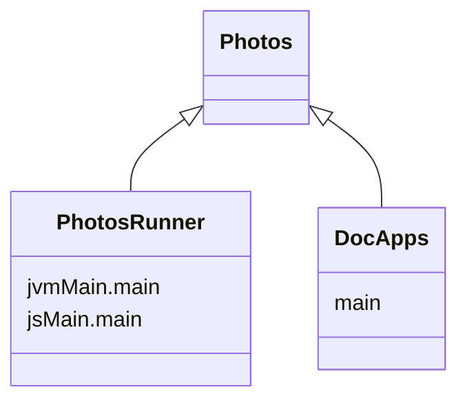

import Tabs      from '@theme/Tabs'
import TabItem   from '@theme/TabItem'

import Gradle            from '!!raw-loader!../../Photos/build.gradle.kts';
import RunnerGradle      from '!!raw-loader!../../PhotosRunner/build.gradle.kts';
import {KPlayground}     from '../src/components/KotlinPlayground'
import {DoodleCodeBlock} from '../src/components/DoodleCodeBlock';
import WebMain           from '!!raw-loader!../../PhotosRunner/src/jsMain/kotlin/main.kt';

# [Photos](https://github.com/nacular/doodle-tutorials/tree/master/Photos) Tutorial

We will build a simple photo app that lets you view and manipulate images using a pointer or multi-touch. Images will be added to the app via drag-drop. You can then move, size, and rotate them with a mouse, pointer, touch, or via an info overlay.

Here is the end result.

<DoodleCodeBlock function="photos" height="700" />

:::tip
You can also see the full-screen app [here](https://nacular.github.io/doodle-tutorials/photos).
:::

## Project Setup

We will use a multi-platform library setup for this app, with a multiplatform launcher that depends on it. This is not necessary to use Doodle. You could create a single multiplatform build with the common parts of your app in `commonMain` etc.. This setup is used here because these apps are also launched by an app within `DocApps` when embedding them like below. Therefore, we need a pure library for each app. This is why there is an app and a runner.

<Tabs>
<TabItem value="app" label="Photos">

[**build.gradle.kts**](https://github.com/nacular/doodle-tutorials/blob/master/Photos/build.gradle.kts)

<KPlayground>{Gradle}</KPlayground>

</TabItem>
<TabItem value="runner" label="PhotosRunner">

[**build.gradle.kts**](https://github.com/nacular/doodle-tutorials/blob/master/PhotosRunner/build.gradle.kts)

<KPlayground>{RunnerGradle}</KPlayground>

</TabItem>
</Tabs>

:::info
Build uses [libs.versions.toml](https://github.com/nacular/doodle-tutorials/blob/master/gradle/libs.versions.toml) file.
:::

## The Application

All Doodle apps must implement the [`Application`](https://nacular.github.io/doodle/docs/applications) interface. The framework will then initialize our app via the constructor.

The app's structure is fairly simple. It has a main Container that holds the images and supports drag-drop, and a panel with controls for manipulating a selected image.

[**PhotosApp.kt**](https://github.com/nacular/doodle-tutorials/blob/master/Photos/src/commonMain/kotlin/io/nacular/doodle/examples/PhotosApp.kt#L11)

<KPlayground>{`
class PhotosApp(/*...*/): Application {
    init {
        // ...
\n
        val panelToggle                 // Button used to show/hide the panel
        val panel                       // Has controls for manipulating images
        val mainContainer = container { // container that holds images
            // ...
\n
            dropReceiver = object: DropReceiver {
                // support drag-drop importing
            }
\n
            GlobalScope.launch {
                listOf("tetons.jpg", "earth.jpg").forEachIndexed { index, file ->
                    // load default images
                }
            }
        }
\n
        display += listOf(mainContainer, panel, panelToggle)
\n
        // ...
    }
\n
    override fun shutdown() {}
}
`}</KPlayground>

:::tip
Notice that `shutdown` is a no-op, since we don't have any cleanup to do when the app closes.
:::

## Creating A Full Screen App

Doodle apps can be [launched](https://nacular.github.io/doodle/docs/applications) in a few different ways. We create a helper to launch the app in [full screen](https://nacular.github.io/doodle/docs/applications#top-level-apps).

[**FullScreen.kt**](https://github.com/nacular/doodle-tutorials/blob/master/Photos/src/main/kotlin/io/nacular/doodle/examples/FullScreen.kt#L22)

<KPlayground>{WebMain}</KPlayground>

:::tip
Normally this would just be your `main` function. But `main` would prevent the app from being used as a library. Which is what happens to allow both an embedded (in the docs) and full-screen version.
:::

The `application` function launches apps. It takes a list of modules, and a lambda that builds the
app. This lambda is within a Kodein injection context, which means we can inject dependencies into our app via
`instance`, `provider`, etc.

Notice that we have included several modules for our app. This includes one for focus, keyboard, drag-drop and several for various View [`Behaviors`](https://nacular.github.io/doodle/docs/rendering/behaviors) (i.e. [`nativeTextFieldBehavior()`](https://nacular.github.io/doodle-api/browser/io.nacular.doodle.theme.native/-native-theme/-companion/native-text-field-behavior.html)) which loads the native behavior for TextFields. We also define some bindings directly in a new module. These are items with no built-in module, or items that only exist in our app code.

:::tip
Check out Kodein to learn more about how it handles dependency injection.
:::

The `application` function also takes an optional HTML element within which the app will be hosted. The app will be hosted in `document.body` if you do not specify an element.

App launching is the only part of our code that is platform-specific; since it is the only time we might care about an HTML element. It also helps support embedding apps into non-Doodle contexts.

## Drag-drop Support

Drag-drop support requires the [`DragDropModule`](https://nacular.github.io/doodle/docs/dragdrop) to work. It then requires setting up drag/drop recognizers on the source/target Views. We created the `mainContainer` for this. You can see that the `dropReceiver` property is set to a `DropReceiver` that controls how the `mainContainer` handles drop events.

<KPlayground>{`
class PhotosApp(/*...*/ private val images: ImageLoader /*...*/): Application {
    init {
        // ...
        val mainContainer = container {
            // ...
\n
            dropReceiver = object: DropReceiver {
                private  val allowedFileTypes                    = Files(ImageType("jpg"), ImageType("jpeg"), ImageType("png"))
                override val active                              = true
                private  fun allowed          (event: DropEvent) = allowedFileTypes in event.bundle
                override fun dropEnter        (event: DropEvent) = allowed(event)
                override fun dropOver         (event: DropEvent) = allowed(event)
                override fun dropActionChanged(event: DropEvent) = allowed(event)
                override fun drop             (event: DropEvent) = event.bundle[allowedFileTypes]?.let { files ->
                    val photos = files.map { GlobalScope.async { images.load(it)?.let { FixedAspectPhoto(it) } } }
\n
                    GlobalScope.launch {
                        photos.mapNotNull { it.await() }.forEach { photo ->
                            import(photo, event.location)
                        }
                    }
                    true
                } ?: false
            }
        }
    }
\n
    // ...
}
`}</KPlayground>

Our `DropReceiver` specifies the supported file-types (jpg, jpeg, and png). It then checks that any drop event contains valid files before accepting it. The `drop(event: DropEvent)` method is called when the user attempts the final drop. Here, the receiver fetches all the allowed files in the bundle, and tries to load and import each one. Notice that the receiver converts raw Image returned by `ImageLoader` into a `FixedAspectPhoto`.

## Importing An Image

We import images using a local `import` function inside the `mainContainer` creation block. This simplifies access to local state. The `import` function takes a photo, which is a `View`, and a location to place it.

<KPlayground>{`
val import = { photo: View, location: Point ->
\n
}
`}</KPlayground>

Import resizes and centers the photo at the given point. It is center-rotates it between -15° and 15°. Finally, a listener is added to the `pressed` pointer event. This moves the photo to the foreground and updates the panel.

<KPlayground>{`
photo.width           = 400.0
photo.position        = location - Point(photo.width / 2, photo.height / 2)
photo.transform       = Identity.rotate(location, (Random.nextFloat() * 30 - 15) * degrees)
photo.pointerChanged += pressed {
    children.move(photo, to = children.size - 1)
    panel.setPhoto(photo)
}
`}</KPlayground>

## Using Gestures

Import also registers a custom gesture listener to support multi-touch scaling and rotations.

<KPlayground>{`
GestureRecognizer(photo).changed += object: GestureListener<GestureEvent> {
    // ...
\n
    override fun started(event: GestureEvent) {
        // capture initial state
        event.consume()
    }
\n
    override fun changed(event: GestureEvent) {
        // 1) calculate rotation angle
        // 2) update photo transform to include rotation
        // 3) update photo bounds based on scaling
        event.consume()
    }
\n
    override fun ended(event: GestureEvent) {
        // simply consume event
        event.consume()
    }
}
`}</KPlayground>

`GestureRecognizer` takes a `View` and emits events whenever it detects motion from 2 or more pointers in that `View`. It also calculates a scale value by comparing the distance between the selected pointers over time.

We register a listener that uses the events to update the photo's `transform` and `bounds`. The listener also consumes events to avoid them making it to subsequent pointer listeners (the `Resizer` used for single pointer manipulation in this case).

### Capturing Initial Gesture State

We record the state of our photo, and the pointers provided by the `GestureRecognizer` on the `started` event. Notice that `GestureRecognizer` provides locations in the photo's local coordinate. This makes sense for a general-purpose utility and matches the way Doodle reports pointer events. We use these values to modify the photo's bounds though, which is defined in its parent's coordinates. So we map the points into the parent before our calculations.

<KPlayground>{`
override fun started(event: GestureEvent) {
    // Capture initial state to apply deltas with in \`changed\`
    originalSize     = photo.size
    originalCenter   = this@container.toLocal(event.center, photo)
    originalVector   = event.initial[1].inParent(photo) - event.initial[0].inParent(photo)
    originalPosition = photo.position
    initialTransform = photo.transform
\n
    event.consume() // ensure event is consumed from Resizer
}
`}</KPlayground>

### Handling Gesture Updates

The values recorded in `started` are used--along with the new state--in the `changed` event to update the selected photo.

<KPlayground>{`
override fun changed(event: GestureEvent) {
    val currentVector = event.current[1].inParent(photo) - event.current[0].inParent(photo)
\n
    // Angle between initial set of points and their current locations
    val transformAngle = atan2(
        originalVector.x * currentVector.y - originalVector.y * currentVector.x,
        originalVector.x * currentVector.x + originalVector.y * currentVector.y
    )
\n
    // Use transform for rotation
    photo.transform = initialTransform.rotate(around = originalCenter, by = transformAngle)
\n
    // Update bounds instead of scale transformation
    photo.bounds = Rectangle(
            originalPosition - ((originalPosition - originalCenter) * (1 - event.scale)),
            originalSize * event.scale)
\n
    event.consume() // ensure event is consumed from Resizer
}
`}</KPlayground>