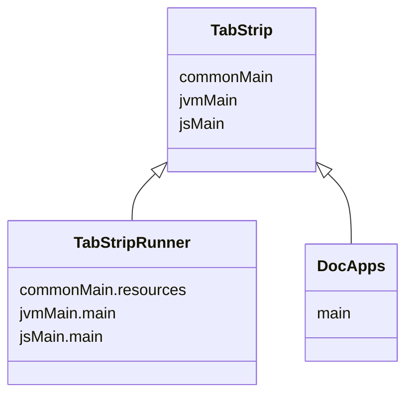

import Tabs      from '@theme/Tabs'
import TabItem   from '@theme/TabItem'
import CodeBlock from '@theme/CodeBlock';

import {DoodleCodeBlock} from '../src/components/DoodleCodeBlock';
import Gradle            from '!!raw-loader!../../TabStrip/build.gradle.kts';
import RunnerGradle      from '!!raw-loader!../../TabStripRunner/build.gradle.kts';
import TabStripApp       from '!!raw-loader!../../TabStrip/src/commonMain/kotlin/io/nacular/doodle/examples/TabStripApp.kt';
import WebMain           from '!!raw-loader!../../TabStripRunner/src/jsMain/kotlin/main.kt';


# [TabStrip](https://github.com/nacular/doodle-tutorials/tree/master/TabStrip) Tutorial

We will build a simple app that hosts animating tab selection component in this tutorial. It is inspired by [Cuberto's Animated Tabbar](https://dribbble.com/shots/14723171-Animated-Tabbar) and this [JS impl](https://codepen.io/aaroniker/pen/rNMmZvq?editors=0110). This app will be multi-platform, which means it will run in the browser and as a desktop application.

The main focus will be utilizing [Doodle's powerful animation APIs](https://nacular.github.io/doodle/docs/animations) to create smooth transitions with precise timings.

<DoodleCodeBlock functionName="tabStrip" height="300" />

You can also see the full-screen app [here](https://nacular.github.io/doodle-tutorials/tabstrip).

---

## Project Setup

This app (like the others in this tutorial) is created as a multi-platform library, with a multiplatform launcher that depends on it.
This is not necessary to use Doodle. You could create a single multiplatform build with the common parts of your app
in `commonMain` etc.. This setup is used here because the app are also launched by an app within `DocApps` when embedding it
like below. Therefore, we need a pure library for the app. This is why there is an app and a runner.



<Tabs>
<TabItem value="TabStrip">

[**build.gradle.kts**](https://github.com/nacular/doodle-tutorials/blob/master/TabStrip/build.gradle.kts)

<CodeBlock language="kotlin">{Gradle}</CodeBlock>

</TabItem>
<TabItem value="TabStripRunner">

[**build.gradle.kts**](https://github.com/nacular/doodle-tutorials/blob/master/TabStripRunner/build.gradle.kts)

<CodeBlock language="kotlin">{RunnerGradle}</CodeBlock>

</TabItem>
</Tabs>

---

## Defining Our Application

All Doodle apps must implement the [`Application`](https://nacular.github.io/doodle/docs/applications) interface. The framework will then initialize our app via the constructor. Our app will be fairly simple: just create an instance of our calculator and add it to the display.

Doodle apps can be defined in `commonMain`, since they do not require any platform-specific dependencies. Therefore, we will do
the same and place ours in `commonMain/kotlin/io/nacular/doodle/examples`.

[**TabStripApp.kt**](https://github.com/nacular/doodle-tutorials/blob/master/TabStrip/src/commonMain/kotlin/io/nacular/doodle/examples/TabStripApp.kt#L11)

<CodeBlock language="kotlin">{TabStripApp}</CodeBlock>

:::tip
Notice that `shutdown` is a no-op, since we don't have any cleanup to do when the app closes.
:::

---

## Launching on Web and Desktop

Doodle apps can be [launched](https://nacular.github.io/doodle/docs/applications) in a few different ways on Web and Desktop. We defined our app logic
in a multi-platform `TabStrip` library (no `main` functions), so it can be used on both platforms. Notice that we are only using a library here because we also want to run the TabStrip in our documentation app. That app will run it as an embedded Web app, which becomes easier if it is a library. Otherwise, we could have defined our platform `main` functions directly in the `TabStrip` module. Instead, we created a separate `TabStripRunner` module that contains our `main` functions.

<CodeBlock language="kotlin" title="main.kt">{WebMain}</CodeBlock>

---

## The TabStrip View

This tutorial will implement the `TabStrip` as a single [`View`](https://nacular.github.io/doodle/docs/views) that manages its state directly. This lets us focus on the animation logic.

:::tip
A production version of this control would be more flexible if it let you pass in the items in the tab and configure what each does when clicked.
:::

The `TabStrip` is composed of a rounded rectangle background (with a drop-shadow), a row of items rendered using paths an indicator that looks like a wave, and a droplet that appears during a new tab selection. All of these elements are rendered directly onto the `TabStrip`'s canvas, so there are no child `View`s involved for this approach.

### Render Logic

All parts of the view are rendered in `TabStrip.render`, which is how all Views draw themselves.

```kotlin
override fun render(canvas: Canvas) {
    val foreGround = (foregroundColor ?: Black).paint
    val backGround = (backgroundColor ?: White).paint

    // draw shadow
    canvas.outerShadow(color = Black opacity 0.1f, blurRadius = 20.0) {
        // draw background rounded rect
        canvas.rect(bounds.atOrigin, radius = cornerRadius, fill = backGround)
    }

    // draw items
    items.forEach { item ->
        val itemScale = 1 - itemScaleChange * item.moveProgress

        // position and scale the item
        canvas.transform(Identity.
            translate(Point(item.x, item.y + itemDipOffset * item.moveProgress)).
            scale(around = Point(item.width / 2, item.height / 2), itemScale, itemScale)) {

            when (item.selectionProgress) {
                1f   -> path(item.selected, fill = foreGround) // fully selected
                else -> {
                    path(item.deselected, fill = foreGround)

                    if (item.selectionProgress > 0f) {
                        // overlay transition if partially selected
                        val dropletCircle = Circle(
                            center = Point(item.width / 2, item.height - dropLetRadius),
                            radius = dropLetRadius + (max(item.width, item.height) - dropLetRadius) * item.selectionProgress
                        )

                        // overlay background fill so it seeps through holes in item
                        circle(dropletCircle, fill = backGround)

                        // draw selected item clip to droplet
                        clip(dropletCircle) {
                            path(item.selected, fill = foreGround)
                        }
                    }
                }
            }
        }
    }

    canvas.translate(indicatorCenter) {
        // draw indicator
        path(indicatorPath, fill = foreGround)

        if (dropletYAboveIndicator != 0.0) {
            // draw droplet so that it's top is at the indicator top when dropletYAboveIndicator == 0
            circle(Circle(
                radius = dropLetRadius,
                center = Point(0, -indicatorHeight + dropLetRadius - dropletYAboveIndicator)
            ), fill = foreGround)
        }
    }
}
```

Notice that the icons and indicator are all drawn after the canvas has been transformed. That is because paths are fixed in space (in our case they are all anchored at `0,0`) and moving them around on a Canvas requires a transform.

You can also see that each icon can be in 1 of 3 states: *deselected*, *partially selected*, *fully selected*. In the first and last case, only the respective path is drawn. But in the transitional state, both paths are drawn, with the selected path being clipped to the droplet circle. We also need to change the background color that leaks through the holes of the path. So a filler circle is drawn before the selected path with the current background fill.

:::info
Many of the parameters used in `render` are ones we will animate (i.e. `icon.moveProgress`, `icon.selectionProgress`, ``indicatorCenter`, `dropletYAboveIndicator`, etc.). Therefore, animation can simply trigger renders to ensure the `TabStrip` always reflects the changes on every tick.
:::

### Triggering The Animation

This component has a complex set of animation that will trigger in a specific sequence to achieve the final look. We will use an injected `Animator` names `animate` to perform all animations. And we will tie animations to click events that select a new item.

The first thing we'll do is track the `selectedItem` as an `observable` property so we can trigger animations when it changes:

```kotlin
private var selectedItem by observable(items.first()) { _,selected -> ... }
```

This item will be initialized to the first item in our list. That list will simply be hard-coded for this tutorial. It tracks data for each item in a simple data object.

```kotlin
private inner class ItemState(val selected: Path, val deselected: Path, var selectionProgress: Float = 0f) {
    val x          get() = position.x
    val y          get() = position.y
    val width      get() = size.width
    val height     get() = size.height
    val centerX    get() = x + width / 2
    val size             = pathMetrics.size(selected)
    val atDefaults get() = selectionProgress == 0f && moveProgress == 0f

    lateinit var position     : Point
             var moveProgress = 0f
}
```

The user is able to change `selectedItem` by clicking on it with the Pointer. We track this by listening to click events on the view directly and deciding which item is selected. We also listen for pointer move events to handle the dynamic cursor, which shows a Pointer when hovering over a non-selected item.

```kotlin
init {
    // ...

    // Listen for item clicks
    pointerChanged += clicked { event ->
        getItem(at = event.location)?.let {
            selectedItem = it
            cursor       = Default
        }
    }

    // Update cursor as pointer moves
    pointerMotionChanged += moved { event ->
        cursor = when (getItem(event.location)) {
            selectedItem, null -> Default
            else               -> Pointer
        }
    }
}
```

The result is that clicking on an item other than `selectedItem` will trigger our observable callback, which is where we do our animation handling.

### Animation Timeline

This is what the full animation timeline looks like. The diagram shows the sequence of events and their timings (to scale).


There are a few important things to note about our approach. First is that we are using an animation block and tracking several top-level animations that will run concurrently via `animations`. This allows us to auto-cancel them whenever a new animation starts. We accomplish this by defining `animations` as an `autoCanceling` property

```kotlin
private var animation: Animation<*>? by autoCanceling()
```

:::tip
Use the `autoCanceling` delegate to get free animation cleanup whenever a new value is assigned to an old one.
:::

Secondly, our approach initiates a lot of follow-on animations at the completion of previous animations (denoted with the dotted lines). Unfortunately, these will not be tracked by our top-level animation block, since blocks only track animations created when the block is executed (see below). So we will need to track all of these to cancel them if tab changes happen during an ongoing animation. These are all lumped into a `secondaryAnimations` set.

:::info

Doodle's animation block captures any animations created while the block is being executed and groups them all under a single animation returned from the block. In the following example, all the animations will be tied to `animations`, so canceling it cancels everything.


```kotlin title="All animations rolled into the result"
val animations = animate {
    0f to 1f using tweenFloat(...).invoke {}
    a  to b  using tweenColor(...).invoke {}

    subAnimation = animate {
        ...
    }
}
```

Doing the following **will not** track the animation created in the `completed` callback.

```kotlin title="Some animations not tracked"
val animations = animate {
    (0f to 1f using tweenFloat(...).invoke {}).apply {
        completed += {
            // this one not, since it is created after the animate block is finished
            a  to b  using tweenColor(...).invoke {}
        }
    }
}

```
:::

We use the second pattern to chain animations together, which means our `animations` property is only tracking a subset. Of course, we could have made this work by tracking start/end times and using delays for all subsequent animations. But that is a bit more tedious.

:::tip
A future version of Doodle could provide ways to offset animations in a block relative to those already defined, which would better serve this use case.
:::

### Animation Logic

The following code has all of the logic to setup the timeline, track secondary animations and cancel anything that is ongoing when it fires.

```kotlin
private var selectedItem by observable(items.first()) { _,selected ->

    // cancel any ongoing secondary animations and hide droplet
    dropletYAboveIndicator = 0.0
    secondaryAnimations.forEach { it.cancel() }
    secondaryAnimations.clear()

    // Animation blocks roll all top-level animations (those created while in the block) into a common
    // parent animation. Canceling that animation cancels all the children.
    // However, our code creates additional animations that are created when top-level ones are completed.
    // These animations are NOT tracked as part of the returned animation group. So they need to be tracked
    // separately, so we can cancel them if anything changes mid-flight.
    // We do that using the secondaryAnimations set.
    animation = animate {
        // Animate all deselected items back to normal
        items.filter { it != selected && !it.atDefaults }.forEach { deselected ->
            deselected.moveProgress      to 0f using (tweenFloat(linear, itemMoveUpDuration)) { deselected.moveProgress      = it }
            deselected.selectionProgress to 0f using (tweenFloat(linear, itemFillDuration  )) { deselected.selectionProgress = it }
        }

        // Indicator moves to selected item
        (indicatorCenter.x to selected.centerX using (tweenDouble(easeInOutCubic, slideDuration)) { indicatorCenter = Point(it, height) }).onCompleted {
            // Selected item moves down
            (selected.moveProgress to 1f using (tweenFloat(linear, itemMoveDownDuration)) { selected.moveProgress = it }).also { secondaryAnimations += it }
        }

        // Indicator primes as it travels to selected item
        (indicatorHeight to minIndicatorHeight using (tweenDouble(linear, primeDuration)) { indicatorHeight = it }).onCompleted {
            // NOTE: All these are secondary animations that won't be attached to the outer animation, since it would have been
            // completed at this point. So they need to be tracked using our secondaryAnimation set.

            // Indicator fires at selected item
            (indicatorHeight to maxIndicatorHeight using (tweenDouble(linear, fireDuration)) { indicatorHeight = it }).onCompleted {
                // Indicator height returns to normal
                (indicatorHeight to defaultIndicatorHeight using (tweenDouble(linear, recoilDuration)) { indicatorHeight = it }).also { secondaryAnimations += it }

                // Droplet moves up to item
                (dropletYAboveIndicator to dropletMaxY using (tweenDouble(linear, dropletTravelDuration)) { dropletYAboveIndicator = it }).onCompleted {
                    // Hide droplet
                    dropletYAboveIndicator = 0.0

                    // Selected item moves up
                    (selected.moveProgress to 0f using (tweenFloat(linear, itemMoveUpDuration)) { selected.moveProgress = it }).also { secondaryAnimations += it }

                    // Item animates droplet within it
                    (selected.selectionProgress to 1f using (tweenFloat(linear, itemFillDuration)) { selected.selectionProgress = it }).also { secondaryAnimations += it }
                }.also { secondaryAnimations += it }
            }.also { secondaryAnimations += it }
        }.also { secondaryAnimations += it }
    }
}
```

### Rendering On Animation

Our animations change many internal variables as they update. These variables all affect how the control is rendered, and therefore need to trigger re-render so their states are constantly in sync with what the control shows at any moment. One option is to have these variables be `renderProperty`s. This would trigger a render call whenever any of them is changed. This approach is fine for cases where only a small number of properties will change at a time; then the number of render calls remains low. Doodle does queue calls to `rerender`, but its best to avoid making those calls to begin with if possible.

So we take a different approach. The `Animator` interface lets you listen to changes to active animations. These events are fired in bulk whenever any animations change, complete, or are canceled. This is a great way to take action at low cost. The code for this is as follows:

```kotlin
init {
    // ...

    // Rerender on animation updates
    animate.listeners += object: Listener {
        override fun changed(animator: Animator, animations: Set<Animation<*>>) {
            rerenderNow() // only called once per animation tick
        }
    }

    // ...
}
```

With this, our component will render itself and listen to pointer events so it can trigger animations.

## Potential Improvements

We focused on the animation logic in this tutorial, but there are other things the `TabStrip` needs to manage given how we've chosen to implement it. These include managing how all the items it draws are positioned relative to its own size.

The approach we chose requires the component to recalculate the offsets of all paths it draws whenever its size changes. That's because everything drawn during render is absolutely positioned on the canvas.

A more production-ready approach might have the component only draw the indicator on its canvas, while having the items as child views. Then it could use a [`Layout`](https://nacular.github.io/doodle/docs/layout/overview) to keep the item positions up to date. Of course, that `layout` would need to participate in the animation and incorporate the animating values into its positioning logic. But this approach would scale better and allow the control to house a more dynamic set of items.