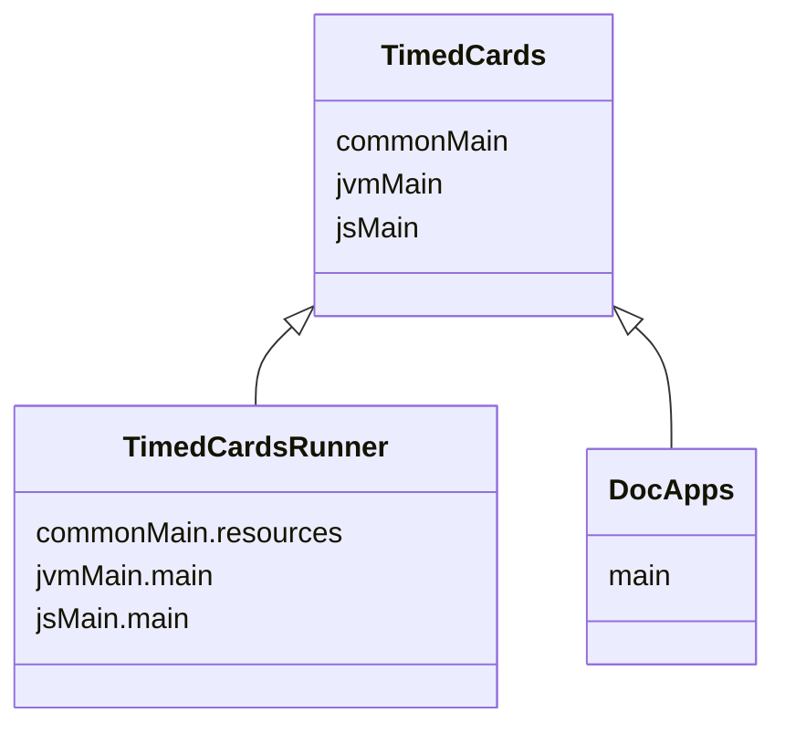

import Tabs      from '@theme/Tabs'
import TabItem   from '@theme/TabItem'
import CodeBlock from '@theme/CodeBlock';

import Gradle            from '!!raw-loader!../../TimedCards/build.gradle.kts';
import RunnerGradle      from '!!raw-loader!../../TimedCardsRunner/build.gradle.kts';
import TimedCardsApp     from '!!raw-loader!../../TimedCards/src/commonMain/kotlin/io/nacular/doodle/examples/TimedCardsApp.kt';
import CardPresenter     from '!!raw-loader!../../TimedCards/src/commonMain/kotlin/io/nacular/doodle/examples/CardPresenter.kt';
import ButtonControls    from '!!raw-loader!../../TimedCards/src/commonMain/kotlin/io/nacular/doodle/examples/ButtonControls.kt';
import Card              from '!!raw-loader!../../TimedCards/src/commonMain/kotlin/io/nacular/doodle/examples/Card.kt';
import WebMain           from '!!raw-loader!../../TimedCardsRunner/src/jsMain/kotlin/main.kt';
import {KPlayground}     from '../src/components/KotlinPlayground'
import {DoodleCodeBlock} from '../src/components/DoodleCodeBlock';

# [TimedCards](https://github.com/nacular/doodle-tutorials/tree/master/TimedCards) Tutorial

This is a simple app that shows the flexibility of Doodle Carousels. It is inspired by [Giulio Cuscito's "Timed Cards Opening"](https://dribbble.com/shots/11012652--Timed-Cards-Opening). This app is multi-platform, which means it will run in the browser and as a desktop application.

The entire app rests on [Doodle's powerful Carousel APIs](https://nacular.github.io/doodle/docs/ui_components/overview#carousel) to create the layout and smooth, perfectly-timed transitions.

<DoodleCodeBlock function="timedCards" height="538.875" />

:::tip
You can also see the full-screen app [here](https://nacular.github.io/doodle-tutorials/timedcards).
:::

## Project Setup

This app (like the others in this tutorial) is created as a multi-platform library, with a multiplatform launcher that depends on it.
This is not necessary to use Doodle. You could create a single multiplatform build with the common parts of your app
in `commonMain` etc.. This setup is used here because the app are also launched by an app within `DocApps` when embedding it
like below. Therefore, we need a pure library for the app. This is why there is an app and a runner.

<Tabs>
<TabItem value="TimedCards">

[**build.gradle.kts**](https://github.com/nacular/doodle-tutorials/blob/master/TimedCards/build.gradle.kts)

<KPlayground>{Gradle}</KPlayground>

</TabItem>
<TabItem value="TimedCardsRunner">

[**build.gradle.kts**](https://github.com/nacular/doodle-tutorials/blob/master/TimedCardsRunner/build.gradle.kts)

<KPlayground>{RunnerGradle}</KPlayground>

</TabItem>
</Tabs>

:::info
Build uses [libs.versions.toml](https://github.com/nacular/doodle-tutorials/blob/master/gradle/libs.versions.toml) file.
:::

## Launching on Web and Desktop

Doodle apps can be [launched](https://nacular.github.io/doodle/docs/applications) in a few different ways on Web and Desktop. We defined our app logic in a multi-platform `TimedCards` library (no `main` functions), so it can be used on both platforms. Notice that we are only using a library here because we also want to run the TimedCards in our documentation app. That app will run it as an embedded Web app, which becomes easier if it is a library. Otherwise, we could have defined our platform `main` functions directly in the `TimedCards` module. Instead, we created a separate `TimedCardsRunner` module that contains our `main` functions.

**main.kt**

<KPlayground>{WebMain}</KPlayground>

## Defining Our Application

All Doodle apps must implement the [`Application`](https://nacular.github.io/doodle/docs/applications) interface. The framework will then initialize our app via the constructor. Our app will be fairly simple: just create an instance of our calculator and add it to the display.

Doodle apps can be defined in `commonMain`, since they do not require any platform-specific dependencies. Therefore, we will do
the same and place ours in `commonMain/kotlin/io/nacular/doodle/examples`.

[**TimedCardsApp.kt**](https://github.com/nacular/doodle-tutorials/blob/master/TimedCards/src/commonMain/kotlin/io/nacular/doodle/examples/TimedCardsApp.kt#L43)

<KPlayground>{TimedCardsApp}</KPlayground>

:::tip
Notice that `shutdown` is a no-op, since we don't have any cleanup to do when the app closes.
:::

## The Card Presenter

This app has a single Carousel that contains almost all of the UI elements. And that Carousel is driven by a custom `Presenter` that manages the layout and animation of the cards within it.

The cards in the Carousel can be in 3 key positions. The first position is that of the selected card, which fills the Carousel and has larger text displayed to the left. The first small card is in the second important position. And the cards to the right of the first card a all in the last key position.

The second position is treated as special because it has to support the transition from small to large card. Therefore the `CardPresenter` needs to track it directly.

<KPlayground>{CardPresenter}</KPlayground>

This presenter is all it takes to handle all the positioning for the Carousel's contents.

## Transitioner

Carousel's also expose a way to manage their automatic movement between frames. This includes changing frames or when a manual move is completed and the Carousel needs to move to a valid frame.

This app uses the `DampedTransitioner` with an animation for auto frame selection. This Transitioner provides a critically damped spring behavior to smoothly complete manual movement (which happens after a swipe for example). And the animation provided by our app is used during frame jumps.

<KPlayground>{`
behavior = object: CarouselBehavior<CardData> {
    override val presenter = CardPresenter<CardData> { itemSize(it) }
\n
    override val transitioner = dampedTransitioner<CardData>(timer, scheduler) { _,_,_, update ->
        animate(0f to 1f, using = tweenFloat(easeInOutCubic, duration = 1.25 * seconds)) {
            update(it)
        }
    }
}
`}</KPlayground>

## Carousel Interactions

The app uses a floating View with controls to interact with the Carousel and monitor its progress. The two buttons trigger `Carousel.previous()` and `Carousel.next()` to switch back and forth between frames. While the progress bar and frame text listen for `Carousel.progressChanged` and update accordingly.

**Button Controls**

<KPlayground>{ButtonControls}</KPlayground>

## Cards

The cards shown in the Carousel are very dynamic and change what they show when moving from their small to large size.

<KPlayground>{Card}</KPlayground>