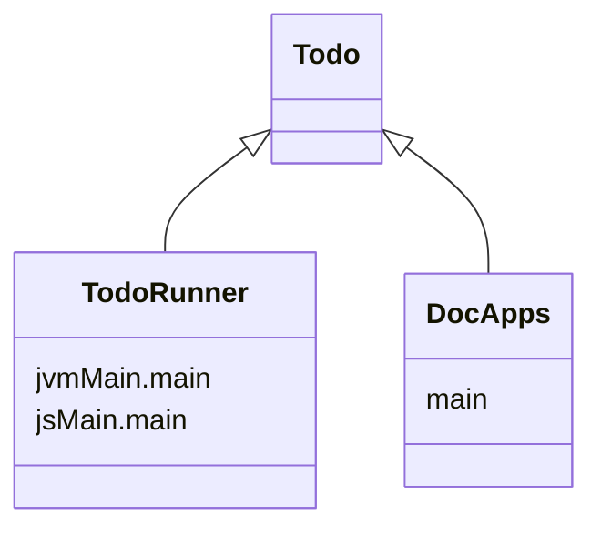

import Tabs      from '@theme/Tabs'
import TabItem   from '@theme/TabItem'

import Gradle            from '!!raw-loader!../../Todo/build.gradle.kts';
import RunnerGradle      from '!!raw-loader!../../TodoRunner/build.gradle.kts';
import TodoApp           from '!!raw-loader!../../Todo/src/commonMain/kotlin/io/nacular/doodle/examples/TodoApp.kt';
import WebMain           from '!!raw-loader!../../TodoRunner/src/jsMain/kotlin/main.kt';
import {KPlayground}     from '../src/components/KotlinPlayground'
import {DoodleCodeBlock} from '../src/components/DoodleCodeBlock';

# [Todo](https://github.com/nacular/doodle-tutorials/tree/master/Todo) Tutorial

This tutorial shows how you might build the [TodoMVC](http://todomvc.com) app using Doodle. This version deviates from the official app spec in that (like all Doodle apps) it does not use CSS or HTML directly. Therefore, it does not include the assets provided by the official spec. Instead, it replicates the UX with Doodle primitives.

This version is also designed to work well as an embedded app. The version below (unlike the full-screen version) does not use routing for the filters. This means there is no way to deep-link to a filter, like the full-screen version has. The launch code decides this by injecting a different strategy for creating the filter buttons, while the app itself is unaware of this difference.

<DoodleCodeBlock function="todo" height="700" />

:::tip
You can also see the full-screen app here: [JavaScript](https://nacular.github.io/doodle-tutorials/todo), [WebAssembly](https://nacular.github.io/doodle-tutorials/todo_wasm).
:::

## Project Setup

We will use a multi-platform library setup for this app, with a multiplatform launcher that depends on it. This is not necessary to use Doodle. You could create a single multiplatform build with the common parts of your app in `commonMain` etc.. This setup is used here because these apps are also launched by an app within `DocApps` when embedding them like below. Therefore, we need a pure library for each app. This is why there is an app and a runner.

<Tabs>
<TabItem value="Todo">

[**build.gradle.kts**](https://github.com/nacular/doodle-tutorials/blob/master/Todo/build.gradle.kts)

<KPlayground>{Gradle}</KPlayground>

</TabItem>
<TabItem value="TodoRunner">

[**build.gradle.kts**](https://github.com/nacular/doodle-tutorials/blob/master/TodoRunner/build.gradle.kts)

<KPlayground>{RunnerGradle}</KPlayground>

</TabItem>
</Tabs>

:::info
Build uses [libs.versions.toml](https://github.com/nacular/doodle-tutorials/blob/master/gradle/libs.versions.toml) file.
:::

## Defining Our Application

All Doodle apps must implement the [`Application`](https://nacular.github.io/doodle/docs/applications) interface. The framework will then initialize our app via the constructor.

Doodle apps can be defined in `commonMain`, since they do not require any platform-specific dependencies. Therefore, we will do the same and place ours in `commonMain/kotlin/io/nacular/doodle/examples`.

[**TodoApp.kt**](https://github.com/nacular/doodle-tutorials/blob/master/Todo/src/commonMain/kotlin/io/nacular/doodle/examples/TodoApp.kt#L11)

<KPlayground>{TodoApp}</KPlayground>

:::tip
Notice that `shutdown` is a no-op, since we don't have any cleanup to do when the app closes.
:::

## Creating A Fullscreen App

Doodle apps can be [launched](https://nacular.github.io/doodle/docs/applications) in a few different ways. We create a helper to launch the app in [full screen](https://nacular.github.io/doodle/docs/applications#top-level-apps).

[**main.kt**](https://github.com/nacular/doodle-tutorials/blob/master/TodoRunner/src/jsMain/kotlin/main.kt#L21)

<KPlayground>{WebMain}</KPlayground>

:::tip
Normally this would just be your `main` function. But `main` would prevent the app from being used as a library. Which is what happens to allow both an embedded (in the docs) and full-screen version.
:::

Use the `application` function to launch top-level apps. It takes a list of modules, and a lambda that builds the app. This lambda is within a Kodein injection context, which means we can inject dependencies into our app via `instance`, `provider`, etc.

Notice that we have included several modules for our app. This includes one for fonts, pointer, keyboard, and several for various View [`Behaviors`](https://nacular.github.io/doodle/docs/rendering/behaviors) (i.e. [`nativeTextFieldBehavior()`](https://nacular.github.io/doodle-api/browser/io.nacular.doodle.theme.native/-native-theme/-companion/native-text-field-behavior.html)) which loads the native behavior for TextFields. We also define some bindings directly in a new module. These are items with no built-in module, or items that only exist in our app code.

:::tip
Check out Kodein to learn more about how it handles dependency injection.
:::

The `application` function also takes an optional HTML element within which the app will be hosted. The app will be hosted in `document.body` if you do not specify an element.

App launching is the only part of our code that is platform-specific; since it is the only time we might care about an HTML element. It also helps support embedding apps into non-Doodle contexts.

## Supporting Docs Embedding

These docs actually launch the app using a custom `main` with a slightly different set of inputs. The big difference is in `FilterButtonProvider` used. The docs inject a provider that creates `PushButton`s instead of `HyperLink`s for the filter controls. The app itself treats these the same. The end result is that the docs version does not use routing.

<KPlayground>{`
// Notice the element is provided for embedded version
application(root = element, modules = listOf(FontModule, PointerModule, KeyboardModule, basicLabelBehavior(),
        nativeTextFieldBehavior(), nativeHyperLinkBehavior(), nativeScrollPanelBehavior(smoothScrolling = true),
        Module(name = "AppModule") {
            // ...
\n
            // Different behavior for docs version
            bind<FilterButtonProvider>() with singleton { EmbeddedFilterButtonProvider(instance()) }
        }
)) {
    // load app just like full-screen
    TodoApp(instance(), instance(), instance(), instance(), instance(), instance(), instance(), instance(), instance(), instance())
}
`}</KPlayground>